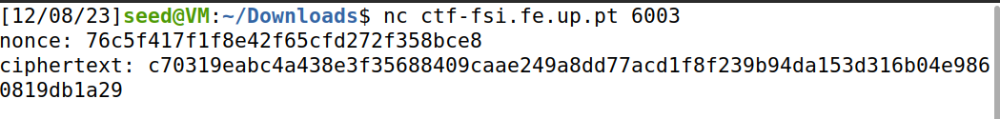

# **CTF Week #10**

**Objective:** Exploit inadequate key generation to decrypt a cryptogram, without access to the symmetric key used to create it.

**Targeted addresses**: http://ctf-fsi.fe.up.pt in port 6003 (`"nc ctf-fsi.fe.up.pt 6003"`)

## Challenge

Access is provided to a server that will send the flag (in its usual format: flag{xxxxxxxx}) encrypted using AES-CTR. This challenge also provides the file `cipherspec.py`.

**File cipherspec.py**

```python
from cryptography.hazmat.primitives.ciphers import Cipher, algorithms, modes
import os

KEYLEN = 16

def gen(): 
	offset = 3 # Hotfix to make Crypto blazing fast!!
	key = bytearray(b'\x00'*(KEYLEN-offset)) 
	key.extend(os.urandom(offset))
	return bytes(key)

def enc(k, m, nonce):
	cipher = Cipher(algorithms.AES(k), modes.CTR(nonce))
	encryptor = cipher.encryptor()
	cph = b""
	cph += encryptor.update(m)
	cph += encryptor.finalize()
	return cph

def dec(k, c, nonce):
	cipher = Cipher(algorithms.AES(k), modes.CTR(nonce))
	decryptor = cipher.decryptor()
	msg = b""
	msg += decryptor.update(c)
	msg += decryptor.finalize()
	return msg
```

After looking at the code (cipherspec.py) and analysing it we are asked 3 questions:

1. How can I use this ciphersuite to encrypt and decrypt data?
* To encrypt and decrypt data we can use the functions `enc` and `dec`.

2. How can I use the vulnerability I've observed to break the code?
* The vulnerability here is the use of a fixed offset of 3 bytes in the gen() function. This results in only a few possibilities for the initial bytes of the key, which can significantly weaken the encryption. So an attacker can exploit this to try various keys more efficiently and possibly perform a brute-force attack.

3. How can I automate this process so that my attack knows it has found the flag?
* We can perform a cryptographic attack like a brute-force attack or analyze patterns in the key generation process to exploit weaknesses. We can use the variables given to us by connecting to the ctf server and get the flag.

After answering the question we proceed to alter the code of the file `cipherspec.py` to make it give us the flag with the variables given by connecting to the server (`"nc ctf-fsi.fe.up.pt 6003"`).

**Given Variables**



**Modified cipherspec.py**

```python
from cryptography.hazmat.primitives.ciphers import Cipher, algorithms, modes
import os
from binascii import unhexlify

KEYLEN = 16

def gen(): 
    offset = 3 # Hotfix to make Crypto blazing fast!!
    key = bytearray(b'\x00'*(KEYLEN-offset)) 
    key.extend(os.urandom(offset))
    return bytes(key)

def enc(k, m, nonce):
    cipher = Cipher(algorithms.AES(k), modes.CTR(nonce))
    encryptor = cipher.encryptor()
    cph = b""
    cph += encryptor.update(m)
    cph += encryptor.finalize()
    return cph

def dec(k, c, nonce):
    cipher = Cipher(algorithms.AES(k), modes.CTR(nonce))
    decryptor = cipher.decryptor()
    msg = b""
    msg += decryptor.update(c)
    msg += decryptor.finalize()
    return msg


ciphertext = unhexlify("c70319eabc4a438e3f35688409caae249a8dd77acd1f8f239b94da153d316b04e9860819db1a29")
nonce = unhexlify("76c5f417f1f8e42f65cfd272f358bce8")


for i in range(256):
        for j in range(256):
            for k in range(256):
                bits = [0] * 13 + [i] + [j] + [k]
                flag = dec(bytes(bits), ciphertext, nonce)
                print(flag)
```

After modifying the code we run the program with the command `python3 cipherspec.py | grep flag` and got the flag.
