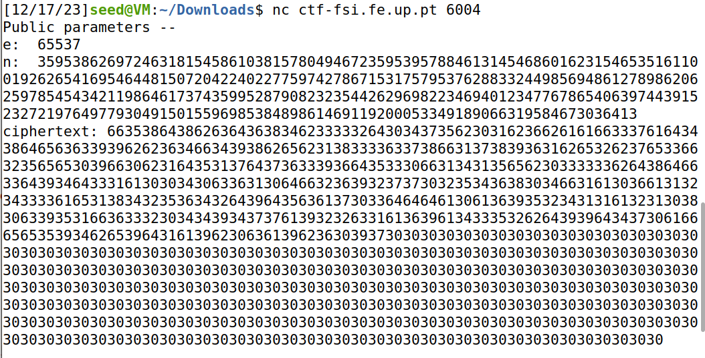
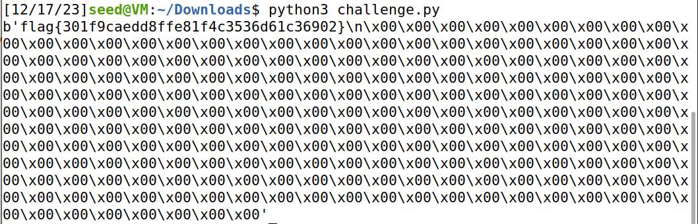

# **CTF Week #11**

**Objective:** Explore the problem of factoring an RSA module with partial knowledge of the primes used to calculate it.

**Targeted addresses**: http://ctf-fsi.fe.up.pt in port 6004 (`"nc ctf-fsi.fe.up.pt 6004"`)

## Challenge

Access is provided to a server that will send the flag (in its usual format: flag{xxxxxxxx}) encrypted using RSA. The associated modulus (n) and the public exponent (e) are also sent.  This system is secure when used well, but the modulus is generated from a set of non-very-impredictable primes. In particular, we know that:

* p is a prime close to 2^512
* q is a prime close to 2^513

In the challenge, is also provided the `challenge.py` file, so we can understand the method for converting the flag in bytes to a numerical value (when encrypting), and a decryption algorithm that does the opposite. Since we're using plain RSA, encrypting m means calculating m^e, and decrypting will be doing (m^e)^d = m.

**File challenge.py**

```python
# Python Module ciphersuite
import os
import sys
from rsa_utils import getParams
from binascii import hexlify, unhexlify

FLAG_FILE = '/flags/flag.txt'

def enc(x, e, n):
    int_x = int.from_bytes(x, "little")
    y = pow(int_x,e,n)
    return hexlify(y.to_bytes(256, 'little'))

def dec(y, d, n):
    int_y = int.from_bytes(unhexlify(y), "little")
    x = pow(int_y,d,n)
    return x.to_bytes(256, 'little')

with open(FLAG_FILE, 'r') as fd:
	un_flag = fd.read()

(p, q, n, phi, e, d) = getParams()

print("Public parameters -- \ne: ", e, "\nn: ", n)
print("ciphertext:", hexlify(enc(un_flag.encode(), e, n)).decode())
sys.stdout.flush()
```

When we connect to the server it gives us the following information:



* e:  65537 
* n:  359538626972463181545861038157804946723595395788461314546860162315465351611001926265416954644815072042240227759742786715317579537628833244985694861278987332515651569520276228835474209243953790590273192730866075719284750306832590152385203684660810997818417464235786203318133184445356256861064566746101184126559
* ciphertext: 6635386438626364363834623333326430343735623031623662616166333761643438646563633939626236346634393862656231383333633738663137383936316265326237653366323565653039663062316435313764373633393664353330663134313565623033333362643864663364393464333161303034306336313064663236393237373032353436383034663161303661313234333361653138343235363432643964356361373033646464613061363935323431316132313038306339353166363332303434393437376139323263316136396134333532626439396434373061666565353934626539643161396230636139623630393730303030303030303030303030303030303030303030303030303030303030303030303030303030303030303030303030303030303030303030303030303030303030303030303030303030303030303030303030303030303030303030303030303030303030303030303030303030303030303030303030303030303030303030303030303030303030303030303030303030303030303030303030303030303030303030303030303030303030303030303030303030303030303030303030303030303030303030303030303030303030303030303030303030303030303030303030303030303030303030303030303030303030303030303030303030

After getting all of the information above we were asked 3 questions:

1. How can I use the information I have to infer the values used in the RSA that encrypted the flag?
* You have information that `p` is a prime close to 2^512 and `q` is a prime close to 2^513. Knowing this, we can approximate `p` as a number slightly smaller than 2^512 and `q` as a number slightly larger than 2^513. We can generate primes around these values using a testing function.

2. How can I find out if my inference is correct?
* After generating potential primes for `p` and `q`, we can test their product to check if it matches the given `n`. If `n = p * q`, then we have found the correct values.

3. Finally, how can I extract my key from the cryptogram I received?
* Given `p`, `q`, and the public exponent `e`, we can compute the private exponent `d`. Once we have `d`, we can use it to decrypt the ciphertext received utilizing the derived `d` and `n` in the decryption function along with the provided `ciphertext` to retrieve the plaintext `flag`.


After answering the questions we procede to modify the file `challenge.py` to make it give us the flag.

**File challenge.py modified to get the flag**

```python
import random
from binascii import hexlify, unhexlify 

FLAG_FILE = '/flags/flag.txt'

def enc(x, e, n):
    int_x = int.from_bytes(x, "little")
    y = pow(int_x,e,n)
    return hexlify(y.to_bytes(256, 'little'))

def dec(y, d, n):
    int_y = int.from_bytes(unhexlify(y), "little")
    x = pow(int_y,d,n)
    return x.to_bytes(256, 'little')

def check_if_prime(num):
    if num != int(num) or num in (0, 1, 4, 6, 8, 9):
        return False
        
    if num in (2, 3, 5, 7):
        return True
        
    sum_val = 0
    divisor = num - 1
    
    while divisor % 2 == 0:
        divisor >>= 1
        sum_val += 1
    assert(2**sum_val * divisor == num - 1)
  
    def test_composite(a):
        if pow(a, divisor, num) == 1:
            return False
        for i in range(sum_val):
            if pow(a, 2**i * divisor, num) == num - 1:
                return False
        return True  
    
    for _ in range(8):
        random_val = random.randrange(2, num)
        if test_composite(random_val):
            return False
 
    return True

def find_next_prime(number):
    while True:
        if check_if_prime(number) and n % number == 0:
            return number
        else:
            number += 1

e = 65537
n = 359538626972463181545861038157804946723595395788461314546860162315465351611001926265416954644815072042240227759742786715317579537628833244985694861278986206259785454342119864617374359952879082323544262969822346940123477678654063974439152327219764977930491501559698538489861469119200053349189066319584673036413
ciphertext = "6635386438626364363834623333326430343735623031623662616166333761643438646563633939626236346634393862656231383333633738663137383936316265326237653366323565653039663062316435313764373633393664353330663134313565623033333362643864663364393464333161303034306336313064663236393237373032353436383034663161303661313234333361653138343235363432643964356361373033646464613061363935323431316132313038306339353166363332303434393437376139323263316136396134333532626439396434373061666565353934626539643161396230636139623630393730303030303030303030303030303030303030303030303030303030303030303030303030303030303030303030303030303030303030303030303030303030303030303030303030303030303030303030303030303030303030303030303030303030303030303030303030303030303030303030303030303030303030303030303030303030303030303030303030303030303030303030303030303030303030303030303030303030303030303030303030303030303030303030303030303030303030303030303030303030303030303030303030303030303030303030303030303030303030303030303030303030303030303030303030303030"

q = find_next_prime(2**513)
p = n // q
d = pow(e, -1, ((p-1)*(q-1)))
flag = dec(unhexlify(ciphertext), d, n)
print(flag)
```

After modifying the code we run the program and got the flag.

