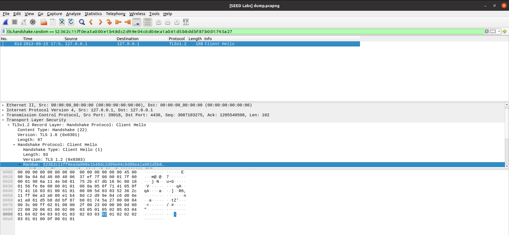
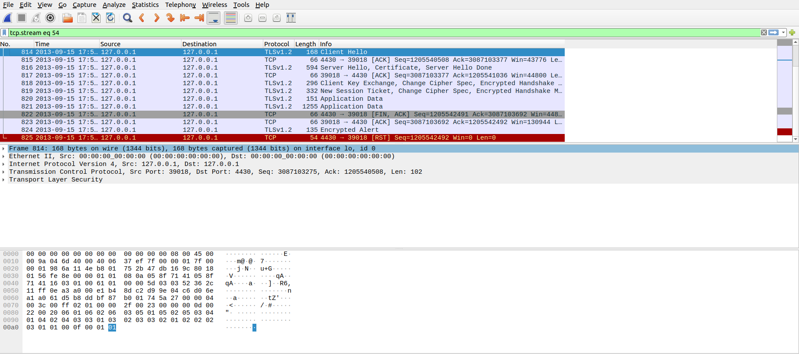
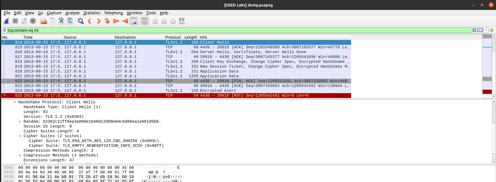
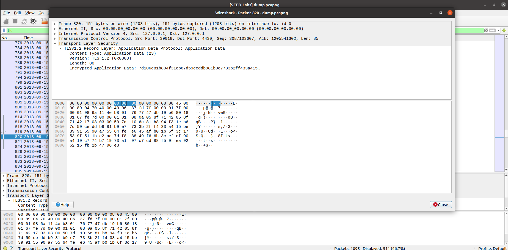
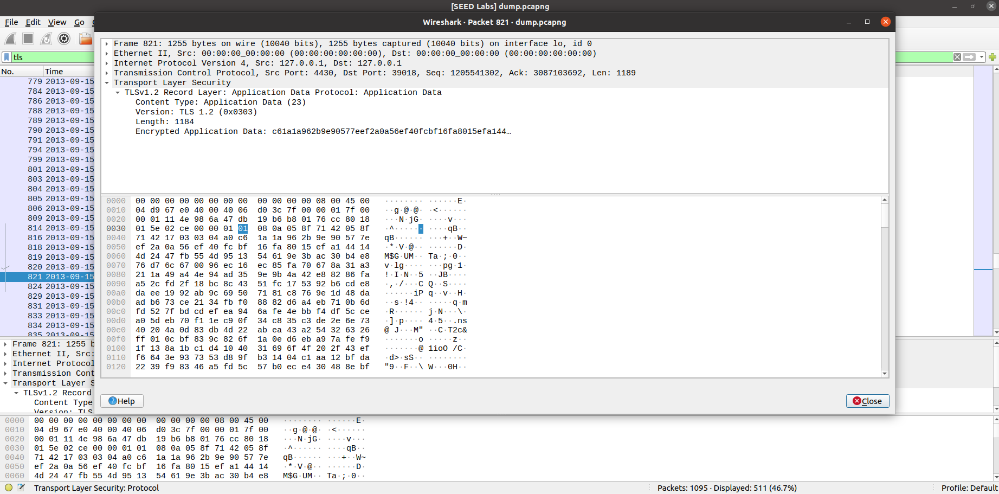
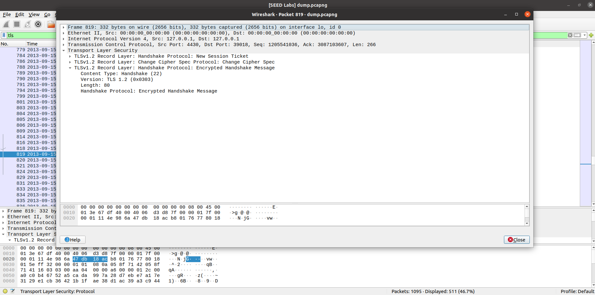

# **CTF Week #13**

**Objective:** learn how to interpret a PCAP file.

## Challenge

This CTF challenge consists of using the Wireshark application to interpret a PCAP file containing multiple TLS connections. The `dump.pcapng` file is provided. This file contains a large number of TLS connections. The flag can be reconstructed from various details of a specific connection. It is suggested to use Wireshark to read and analyze this file.

Specifically, we are interested in the handshake where the random number used in the Client Hello message was: `52362c11ff0ea3a000e1b48dc2d99e04c6d06ea1a061d5b8ddbf87b001745a27`

The flag has the structure: flag{<frame_start>-<frame_end>-<selected_cipher_suite>-<total_encrypted_appdata_exchanged>-<size_of_encrypted_message>}, where:
- <frame_start> and <frame_end> are the first and last (respectively) frame numbers corresponding to the TLS handshake procedure.
- <selected_cipher_suite> is the ciphersuite chosen for the TLS connection (the name, not the code)
- <total_encrypted_appdata_exchanged> is the sum of the encrypted data exchanged on this channel, up to its termination.
- <size_of_encrypted_message> is the size of the encrypted message in the handshake that completed the handshake procedure.

We started by using the Wireshark filter to search for the message that has the random number we were looking for (`52362c11ff0ea3a000e1b48dc2d99e04c6d06ea1a061d5b8ddbf87b001745a27`) and found out that the message we were looking for was the one with the number 814.

- So the <frame_start> is `814`.

After that we started looking for the values to build the flag.

- For the <frame_end> we looked at the handshake in wireshark and saw that the last frame number corresponding to the TLS handshake procedure is `819`. The one with the Info table being "New Session Ticket, Change Cipher Spec, Encrypted Handshake Message".

- For the <selected_cipher_suite> we looked for the Cipher Suites in the Client Hello message and concluded that the answer is `TLS_RSA_WITH_AES_128_CBC_SHA256`.

- For the <total_encrypted_appdata_exchanged> we looked for the packet with the Info table being "Application Data" (Packet 820 and Packet 821) and sum the encrypted data exchanged and concluded that the answer is `1264` (80 + 1184 = 1264).

- For the <size_of_encrypted_message> we looked for the last frame number corresponding to the TLS handshake procedure in the TLSv1.2 Record Layer: Handshake Protocol: Encrypted Handshake Message and saw that the size of the encrypted message is `80`.

With the information gathered we built the flag.

**Flag Identified ->** `flag{814-819-TLS_RSA_WITH_AES_128_CBC_SHA256-1264-80}`
