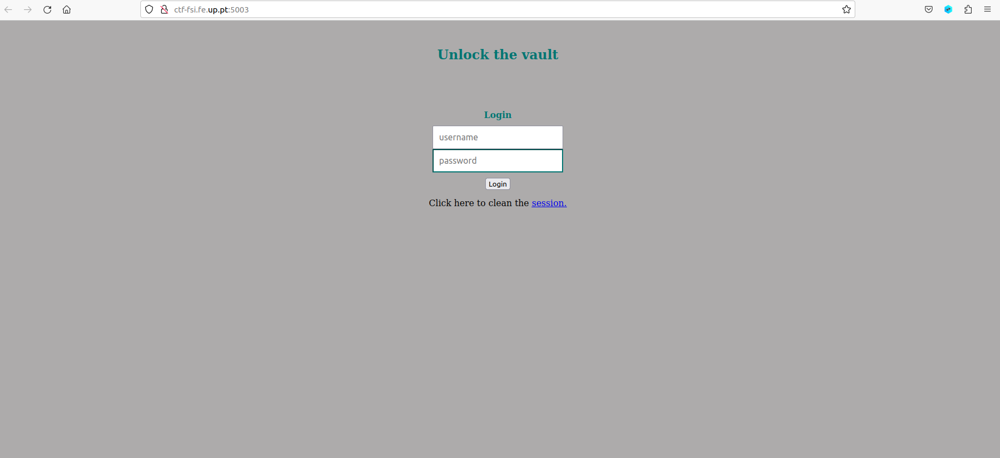
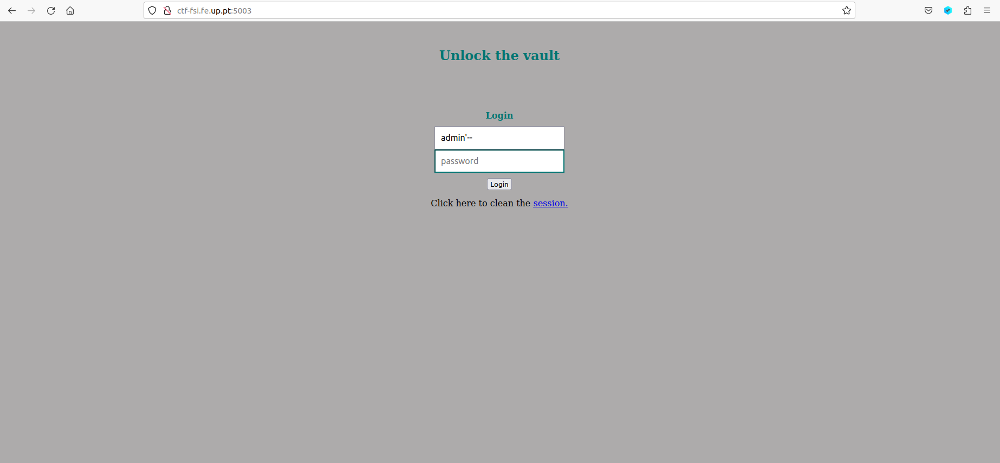
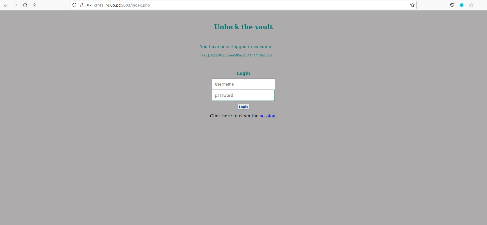

# **CTF Week #8**

**Objective:** Exploit a simple SQL injection to bypass an authentication feature.

**Targeted addresses**: http://ctf-fsi.fe.up.pt in port 5003 (`"nc ctf-fsi.fe.up.pt 5003"`)

## Challenge

This challenge consists of applying what we learned in SEED Labs about SQL injection. In particular, manipulating queries that read from the database and are dynamically generated from user input. A PHP file `index.php` is provided with the code that runs on the server side each time a user tries to authenticate on the portal. The flag is found in a `flag.txt` file that is shown to authenticated users.

We started by exploring the website as a regular user, and its layout was simple with just a login section with a username field and a password field.



After that we investigated the PHP code and tried to understand how the SQL queries are formed from the user's input.

``` php
<h2>Unlock the vault</h2> 
      <div class = "container form-signin">
         
         <?php
            if (!empty($_POST)) {

               require_once 'config.php';

               $username = $_POST['username'];
               $password = $_POST['password'];
               
               $query = "SELECT username FROM user WHERE username = '".$username."' AND password = '".$password."'";
                                     
               if ($result = $conn->query($query)) {
                                  
                  while ($data = $result->fetchArray(SQLITE3_ASSOC)) {
                    $_SESSION['username'] = $data['username'];
           
                    echo "<p>You have been logged in as {$_SESSION['username']}</p><code>";
                    include "/flag.txt";
                    echo "</code>";

                 }
               } else {            
                   // falhou o login
                   echo "<p>Invalid username or password <a href=\"index.php\">Tente novamente</a></p>";
               }
            }
         ?>
      </div> <!-- /container -->
```

Looking at the source code (index.php) we are asked 3 questions:

1. What SQL query is executed for each login attempt?
* The SQL query executed for each login attempt is `$query = "SELECT username FROM user WHERE username = '".$username."' AND password = '".$password."'";`.

2. What input can you manipulate to usurp the query? What special characters did you use and why?
* We can manipulate the "username" and "password" input fields in the login form to potentially inject SQL code. The special characters we used were the  single quotes (') and the double hyphens (--) to comment out the rest of the query, effectively making it ignore the "AND password = ''" part. 

3. Which SQL query is actually executed with your malicious login attempt? Why does this query allow you to log in?
* We chose to inject the following SQL code in the username login field: `admin'--`. By inputting this in the username field and sending it to the server, the query will replace `$username` with the injected SQL code, which will transform the query structure into `$query = "SELECT username FROM user WHERE username = 'admin'--' AND password = '".$password."'";`. The `'` we placed after admin will close the search string, meaning that the characters `--` will be interpreted as SQL code. In SQL, `--` is the syntax to comment a line, so the query will comment everything past `'admin'`, basically turning the query into the following: `$query = "SELECT username FROM user WHERE username = 'admin'";`. The query now only searches the database using a username,  which allows us to log into an account by only having knowledge of its username, the password is now irrelevant.

Finally, we returned to the website and applied the above explained exploit. We typed `admin'--` in the username field, and we can type anything we'd like in the password field, it won't be used to validate the login, but it's a required field.



Executing the login we obtained the flag:




