# **Week #10**

## **SEEDs Lab**

https://seedsecuritylabs.org/Labs_20.04/Crypto/Crypto_Encryption/

## Task 1 - Frequency Analysis

In this task we are given a cipher-text that is encrypted using a monoalphabetic cipher; namely, each letter in the original text is replaced by another letter, where the replacement does not vary (i.e., a letter is always replaced by the same letter during the encryption) and we need to find out the original text using frequency analysis.

We started by running the python program `freq.py` over the given text file `ciphertext.txt` and we got below
results:

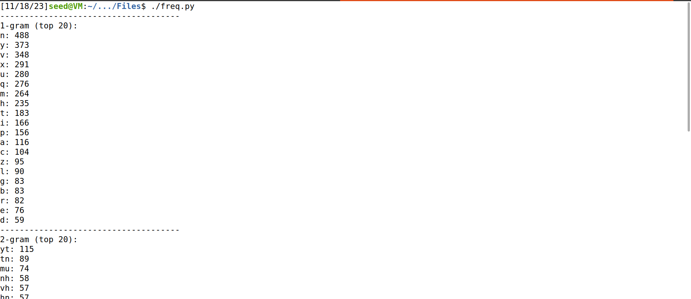
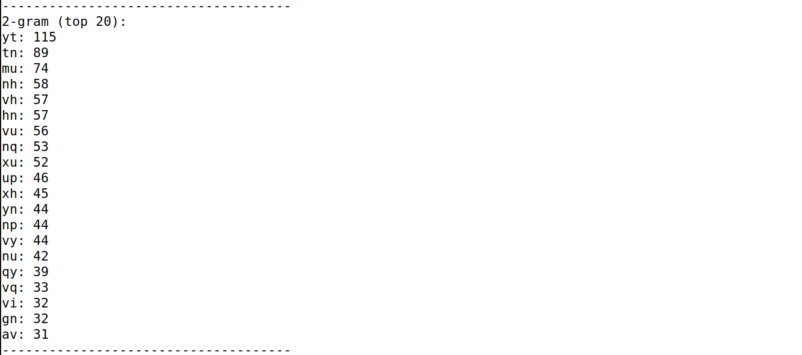
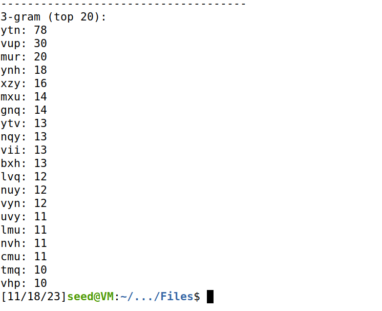

After analysing above counts and the ciphertext.txt file, we concluded some common substitutions of the
ciphers directly after seeing the top 20 trigrams and bigrams, such as `ytn` is `THE`, `v` is `A` and so, `vu` is
`AN`, `vy` is `AT`.

After some more analysis and trials, we were able to conclude the encryption key and converted it into a plaintext, as shown below:

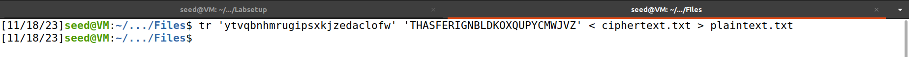

After executing the command above we saw the `plaintext.txt` file as shown below:

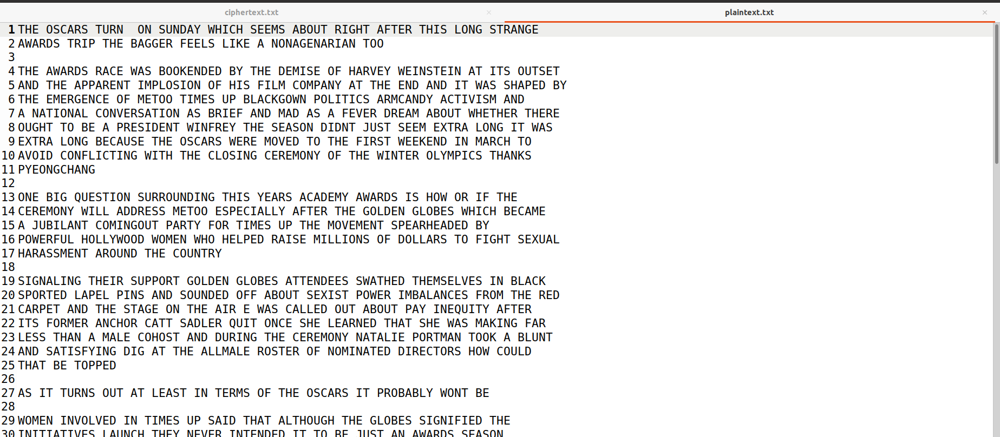

## Task 2 - Encryption using Different Ciphers and Modes

In this task, we will play with various encryption algorithms and modes and we should try at least 3 different ciphers to encrypt and decrypt a text file. We chose to use `AES-128-CBC`, `BF-CBC` and `AES-128-CFB`.

Firstly, we created a file called `task2.txt` to be used in this task as shown below:

After that, we started the using the ciphers with the `OPENSSL ENC` command.

### AES-128-CBC

We used the following command:

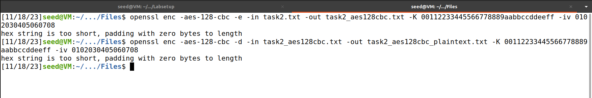

The encrypted file looked like below:

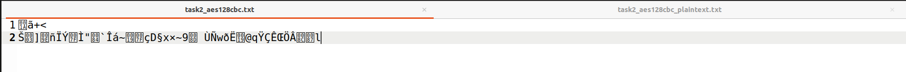

And the decrypted file gave our original text back:

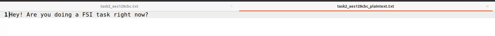

### BF-CBC

We used the following command:

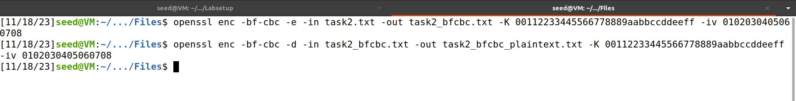

The encrypted file looked like below:

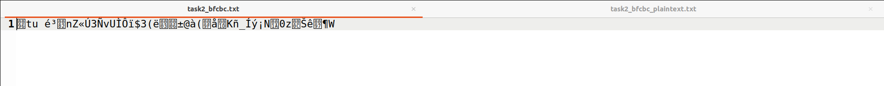

And the decrypted file gave our original text back:

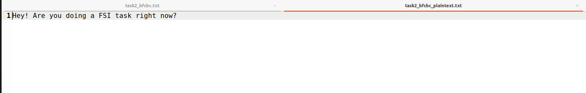

### AES-128-CFB

We used the following command:

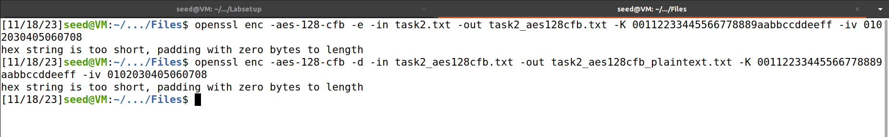

The encrypted file looked like below:

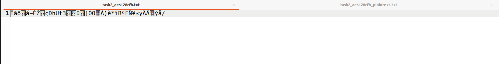

And the decrypted file gave our original text back:

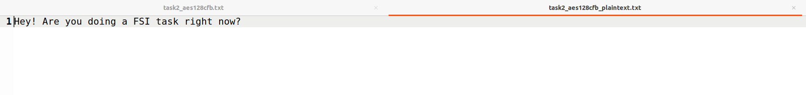

## Task 3 - Encryption Mode – ECB vs. CBC

In this task, we will work with the `pic original.bmp` picture. We will try encrypt this picture usingmthe ECB (Electronic Code Book) and CBC (Cipher Block Chaining) modes, so people without the encryption keys cannot know what is in the picture.

We encrypted a given picture using AES-128 cipher with CBC and ECB mode, as shown below:

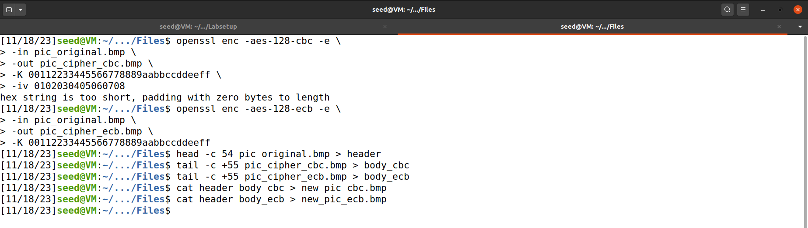

The results obtained are:

### Original Picture

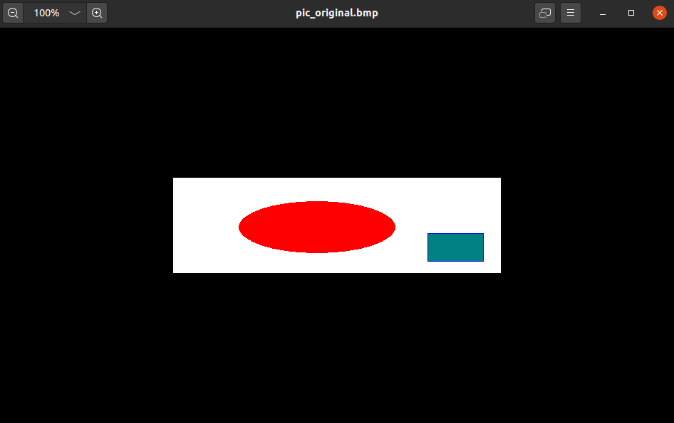

### Encrypted Picture with AES-128 using ECB 

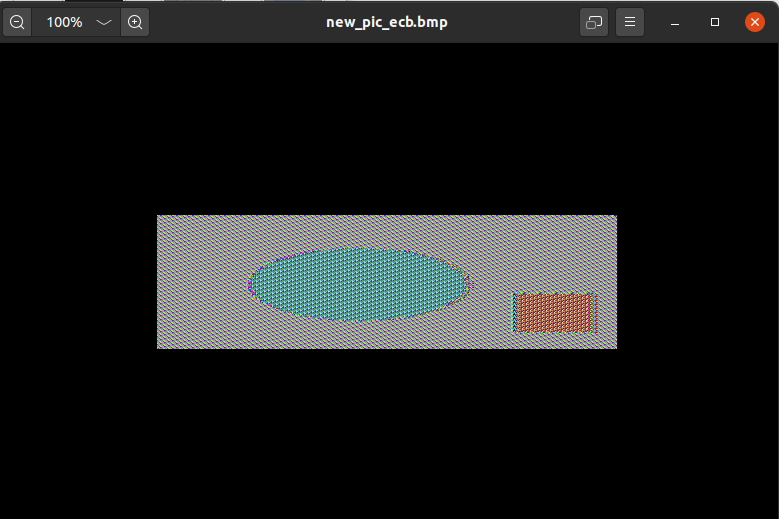

### Encrypted Picture with AES-128 using CBC

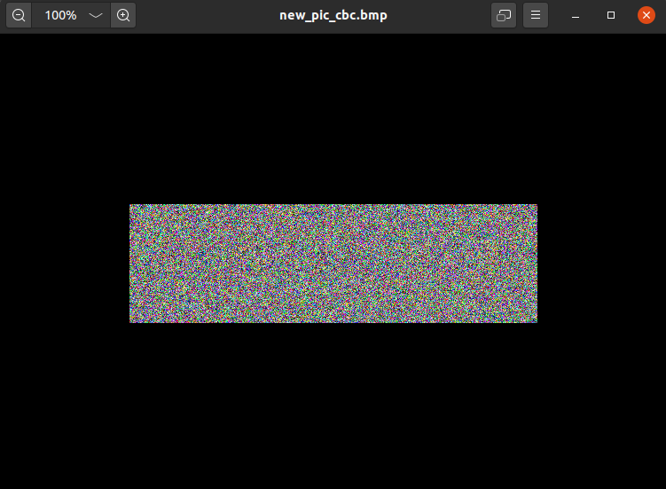

Our Observations:
- ECB mode leaks data about the underlying message being encrypted. The reason this happens is because it produces identical ciphertext blocks after encrypting identical plaintext blocks.
- CBC mode eliminates the ECB issue. The plaintext of a block is combined with the ciphertext of the previous block via XOR operation and the result is encrypted.