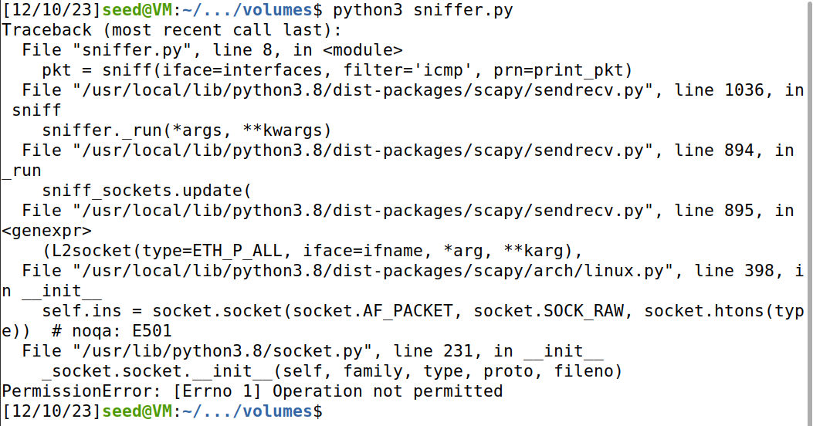

# **Week #13**

## **SEEDs Lab**

https://seedsecuritylabs.org/Labs_20.04/Networking/Sniffing_Spoofing/

## Lab Task Set 1: Using Scapy to Sniff and Spoof Packets

It was given this code:

```python
#!/bin/bin/python
from scapy.all import *

a = IP()
a.show()
```

In this code, the `IP()` method creates and returns a new IP default and empty packet.
If we execute the `show()` command it will display the contents of the packet.
We used `sudo` the root privilege because it’s required for packet manipulations.


### Task 1.1 - Sniffing Packets
### Task 1.1A.

The objective of this task is to learn how to use Scapy to do packet sniffing in Python programs.

```python
#!/usr/bin/python
from scapy.all import *

def print_pkt(pkt):
  pkt.show()

interfaces = ['br-28f585b26006','enp0s3','lo']
pkt = sniff(iface=interfaces, filter='icmp', prn=print_pkt)
```

We picked these interfaces using the command `ifconfig` in terminal and mentioned them in a list of the interfaces we wish to sniff the packets from. Using the filter, Scapy will show us only ICMP packets.


In order to run the program with the root privilege, we made this possible with the help of the following command: `sudo chmod a+x sniffer.py`. We then used the `ping` command with `google.com` for the ICMP echo request and reply packets.


After that we ran the program again, but this time, without using the root privilege.



Running the program using sudo allows us to see the whole network traffic in the given interfaces, without using root privilege we get the error `PermissionError: [Errno 1] Operation not permitted`.
So, if we want to sniff packets, we need root privileges to see the network traffic and capture the relevant packets.

### Task 1.1B.

Usually, when we sniff packets, we are only interested certain types of packets. We can do that by setting filters in sniffing. Scapy’s filter use the BPF (Berkeley Packet Filter) syntax; you can find the BPF manual from the Internet.

- `Capture only the ICMP packet`, we proceed to modify the code of the file `sniffer.py` to do that:

```python
#!/usr/bin/python
from scapy.all import *

def print_pkt(pkt):

	if pkt[ICMP] is not None:
		if pkt[ICMP].type == 0 or pkt[ICMP].type == 8:
			print("ICMP Packet=====")
			print(f"\tSource: {pkt[IP].src}")
			print(f"\tDestination: {pkt[IP].dst}")
			
			if pkt[ICMP].type == 0:
				print(f"\tICMP type: echo-reply")
				
			if pkt[ICMP].type == 8:
				print(f"\tICMP type: echo-request")

interfaces = ['br-28f585b26006','enp0s3','lo']
pkt = sniff(iface=interfaces, filter='icmp', prn=print_pkt)
```


- `Capture any TCP packet that comes from a particular IP and with a destination port number 23`, we proceed to modify the code of the file `sniffer.py` to do that:

```python
#!/usr/bin/python
from scapy.all import *

def print_pkt(pkt):
	if pkt[TCP] is not None:
		print("TCP Packet=====")
		print(f"\tSource: {pkt[IP].src}")
		print(f"\tDestination: {pkt[IP].dst}")
		print(f"\tTCP Source port: {pkt[TCP].sport}")
		print(f"\tTCP Destination port: {pkt[TCP].dport}")
		
interfaces = ['br-28f585b26006','enp0s3','lo']
pkt = sniff(iface=interfaces, filter='tcp port 23 and src host 10.0.2.15',
prn=print_pkt)
```

The host is 10.0.2.15 because it is the IP of our VM.


- `Capture packets comes from or to go to a particular subnet`, we proceed to modify the code of the file `sniffer.py` to do that:

```python
#!/usr/bin/python
from scapy.all import *

def print_pkt(pkt):
	pkt.show()
	
interfaces = ['br-28f585b26006','enp0s3','lo']
pkt = sniff(iface=interfaces, filter='dst net 128.230.0.0/16', prn=print_pkt)
```

We also made a new file called `send_subnet_packet.py` to send packets to the particular subnet.

```python
from scapy.all import *

ip=IP()
ip.dst='128.230.0.0/16'
send(ip,4)
```


We also captured the packet sent with Wireshark.


### Task 1.2 - Spoofing ICMP Packets

The objective of this task is to spoof IP packets with an arbitrary source IP address.

With the code given we proceed to modify it to sent an ICMP packet using a random IP source ‘1.2.3.4’ to the IP of our VM (10.0.2.15).

```python
from scapy.all import *

a = IP()
a.src = '1.2.3.4'
a.dst = '10.0.2.15'
send(a/ICMP())
ls(a)
```


We used Wireshark to observe whether our request will be replied to by the receiver.


### Task 1.3 - Traceroute

The objective of this task is to use Scapy to estimate the distance, in terms of number of routers, between our VM and a selected destination.

```python
from scapy.all import *

inRoute = True
i = 1
while inRoute:
	a = IP(dst='216.58.210.36', ttl=i)
	response = sr1(a/ICMP(),timeout=7,verbose=0)
	
	if response is None:
		print(f"{i} Request timed out.")
	elif response.type == 0:
		print(f"{i} {response.src}")
		inRoute = False
	else:
		print(f"{i} {response.src}")
		
	i = i + 1
```

The destination IP is `216.58.210.36`  which is Google LLC. The flag `ttl` of the packet is increasing by one in each given packet. We used a while loop which will keep iterating as long as it’s routing. The sr1() method of Scapy is a method which will listen and wait for a packet
response (timeout = time limit for response, verbose = ignore printing unnecessary details).

This program figures out how many routers it takes to send out that packet all the way to the IP address destination. Each line at the display is a diferent router. The time-to-live is used to return an error of each router till the destination, this way we can print each IP router till it stops. 


In this case we reached 15 diferent routers, 5 of them are timed out.

### Task 1.4 - Sniffing and-then Spoofing

In this task, we will combine the sniffing and spoofing techniques to implement the following sniff-and-then-spoof program. We need two machines on the same LAN: the VM and the user container. From the user container, we ping an IP X. This will generate an ICMP echo request packet. If X is alive, the ping program will receive an echo reply, and print out the response.

This is the program we will be using during this task:

```python
#!/usr/bin/python
from scapy.all import *

def spoof_pkt(pkt):

	if ICMP in pkt and pkt[ICMP].type == 8:
		print("Original Packet...............")
		print("Source IP : ", pkt[IP].src)
		print("Destination IP : ", pkt[IP].dst)
		
		ip = IP(src=pkt[IP].dst, dst=pkt[IP].src, ihl=pkt[IP].ihl)
		icmp = ICMP(type=0, id=pkt[ICMP].id, seq=pkt[ICMP].seq)
		data = pkt[Raw].load
		newpkt = ip/icmp/data
		
		print("Spoofed Packet...............")
		print("Source IP : ", newpkt[IP].src)
		print("Destination IP : ", newpkt[IP].dst)
		
		send(newpkt, verbose=0)

filter = 'icmp and host 1.2.3.4' #The host IP will be changed to correspond to the 3 IPs we will test	

pkt = sniff(iface= 'br-28f585b26006', filter=filter, prn=spoof_pkt)
```

In our experiment, we will ping the following three IP addresses from the user container.

- `ping 1.2.3.4`

User container sends a ping to `1.2.3.4` which is a non-existing host on the Internet. Without the program we will get a 100% packet loss because it will never return to the source. We can see that with the program the user container is getting a response from the IP.


- `ping 10.9.0.99`

User container sends a ping to `10.9.0.99` which is a non-existing host on the Internet. Without the program we will get a 100% packet loss because it will never return to the source. We can see that with the program the user container is still not getting a response from the IP.


- `ping 8.8.8.8`

User container sends a ping to `8.8.8.8` which is an existing host on the Internet. This scenario is diferent from the others because it really exists on the net. So in this case we are getting duplicate responses, that’s because the real destination is responding to the source, but our program is also responding to the source.


