# **Week #4**

## **SEEDs Lab**

https://seedsecuritylabs.org/Labs_20.04/Software/Environment_Variable_and_SetUID/

## Task 1 - Manipulating Environment Variables

 

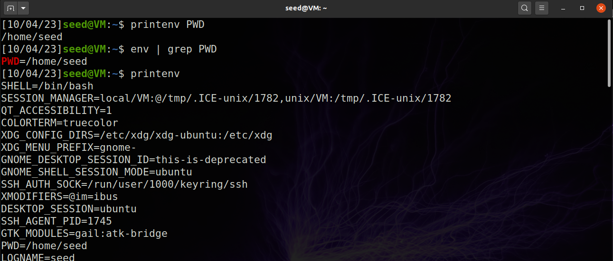

Using the printenv or env command will print out the enviromnet variables.

---

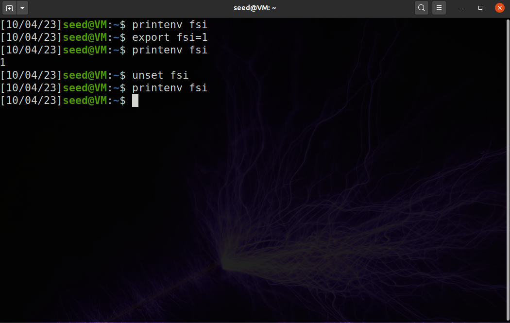

Export will set an environmnet variable and unset will remove it.

 

## Task 2 - Passing Environment Variables from Parent Process to Child Process

 

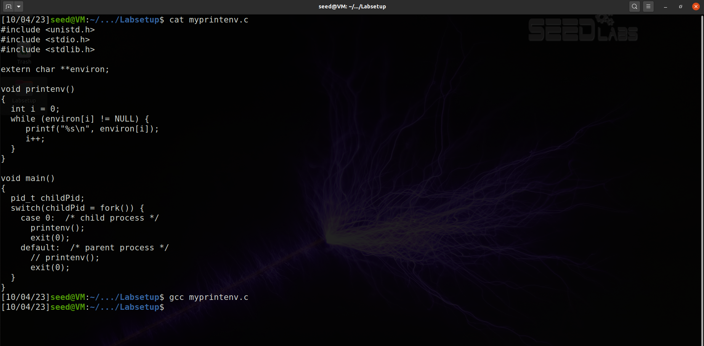

Compiling the child process version.

---

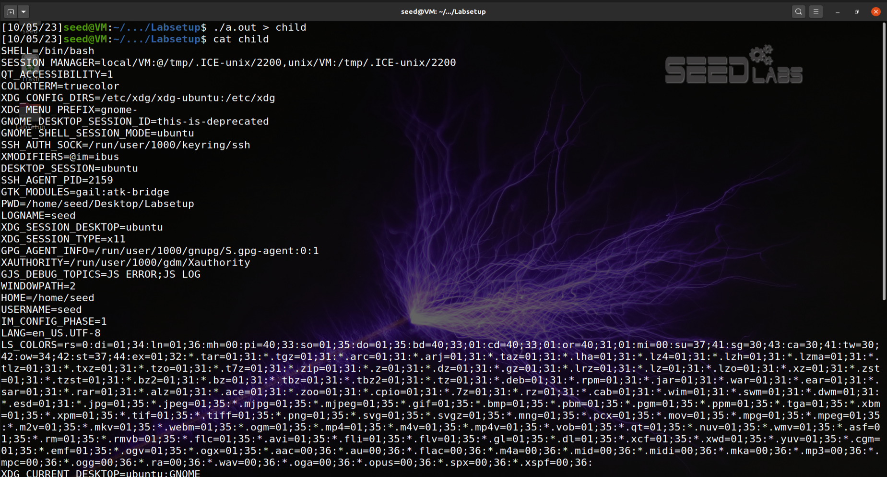

Running the child process version and saving the environment variables into a file.

---

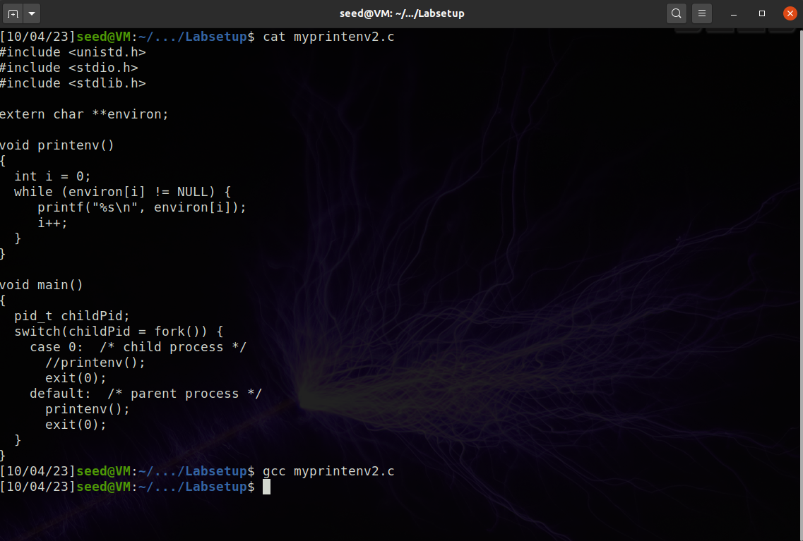

Compiling the parent process version.

---

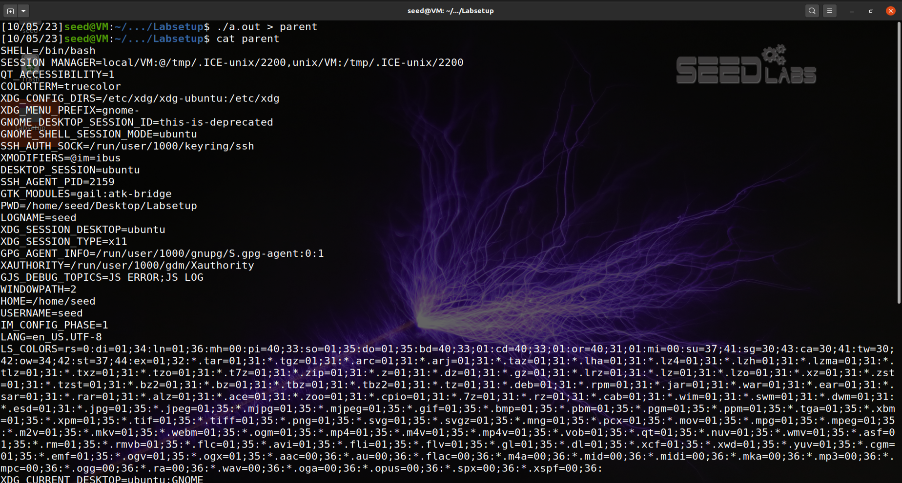

Running the parent process version and saving the environment variables into a file.

---

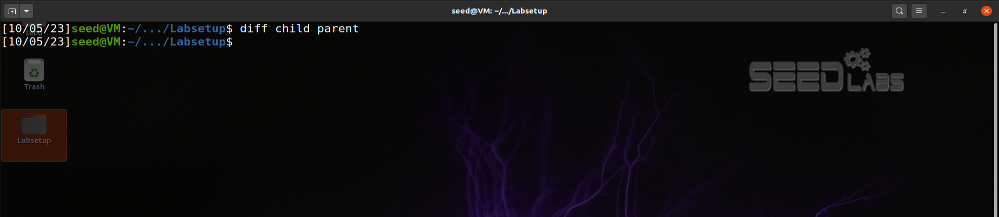

Comparing both processes environment variables variables with the command "diff".

---

### Conclusion: 
The environment variables for a parent process and its child process are the same

 

## Task 3 - Environment Variables and execve()

 

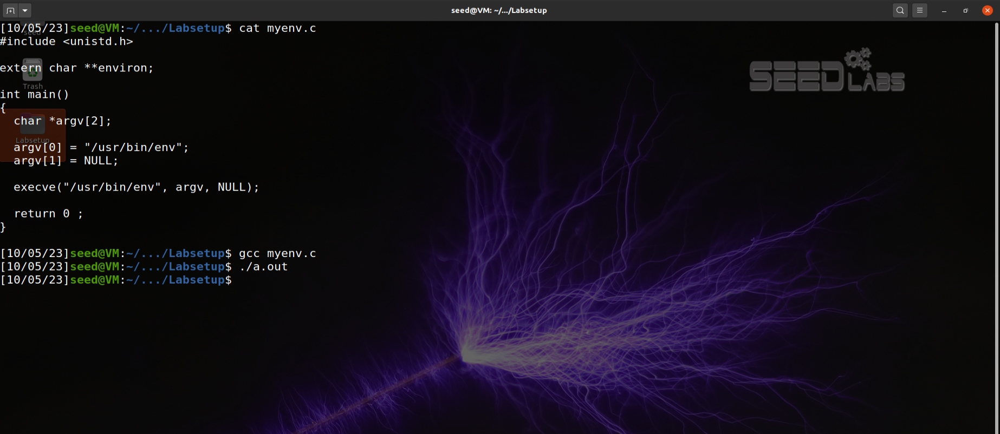

Compiling and running "myenv.c". Nothing gets printed.

---

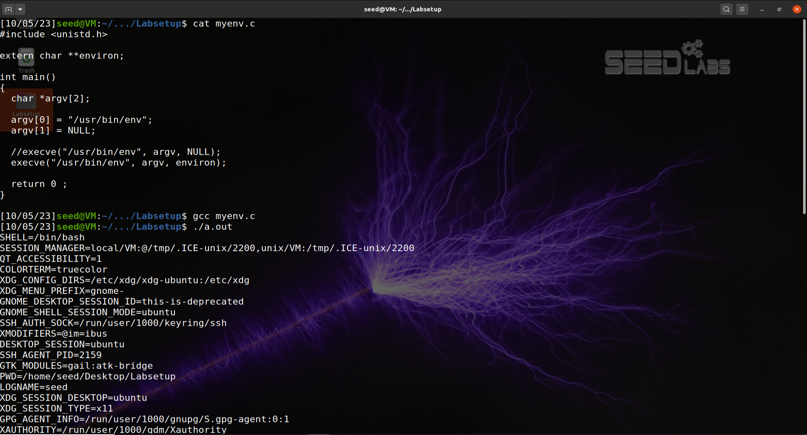

Compiling and running "myenv.c" with alterations. Program prints environment variables.

---

### Conclusion:
If the third parameter in the invocation of execve() is set to "NULL", the program doesn't have access to the environment variables, therefore the program couldn't print anything. If the third parameter in the invocation of execve() is set to "environ" then the program has access to the environment variables and prints it.

 

## Task 4 - Environment Variables and system()

 

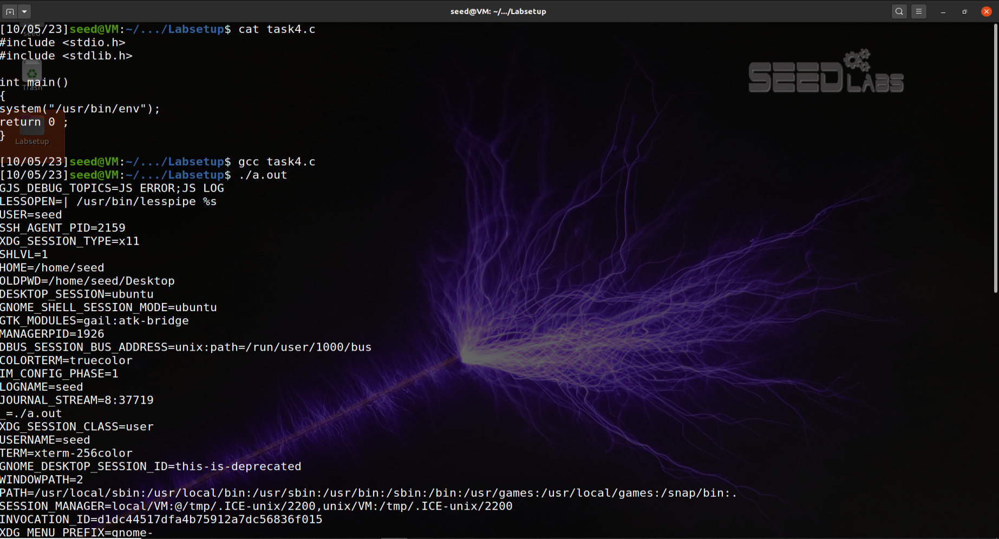

Compiling and running "task4.c" program. Prints the environment variables.

---

### Conclusion:
The "system" function uses "execl", which in its turn calls "execve" with the parent's process environment variables, which finally executes "/bin/sh" with the argument passed to "system" and prints the environment variables value.

 

## Task 5 - Environment Variable and Set-UID Programs

 

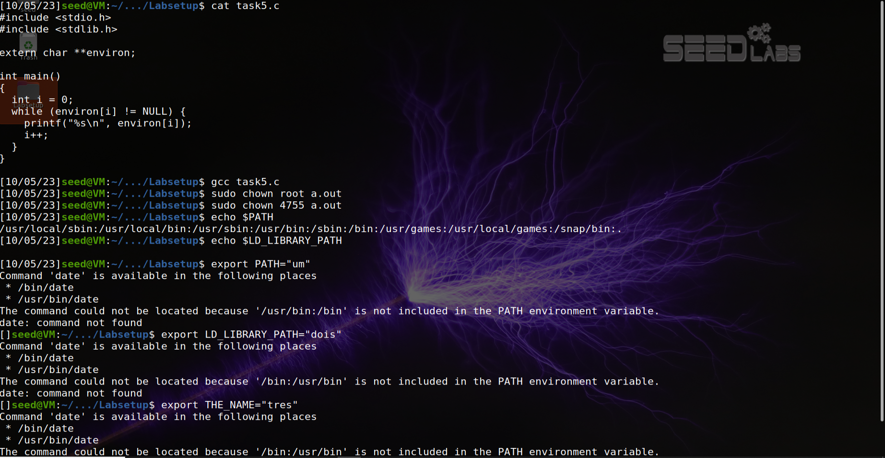

Compiling "task5.c" program and setting environment variables values.

---

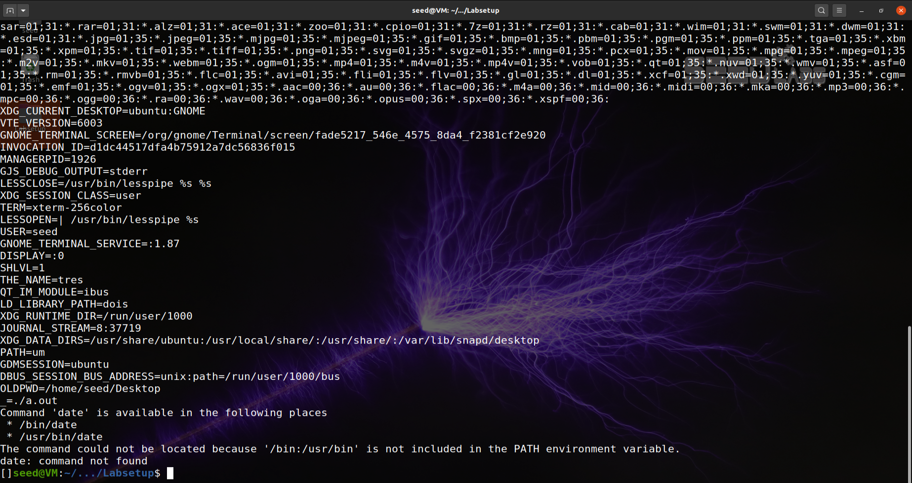

Running "task5.c" program and seeing the values of environment variables that were changed.

---

### Conclusion:
After performing all the steps, we were able to view the three environment variables (PATH, LD_LIBRARY_PATH e the created variable THE_NAME) with the values ​​we entered.

 

## Task 6 - The PATH Environment Variable and Set-UID Programs

 

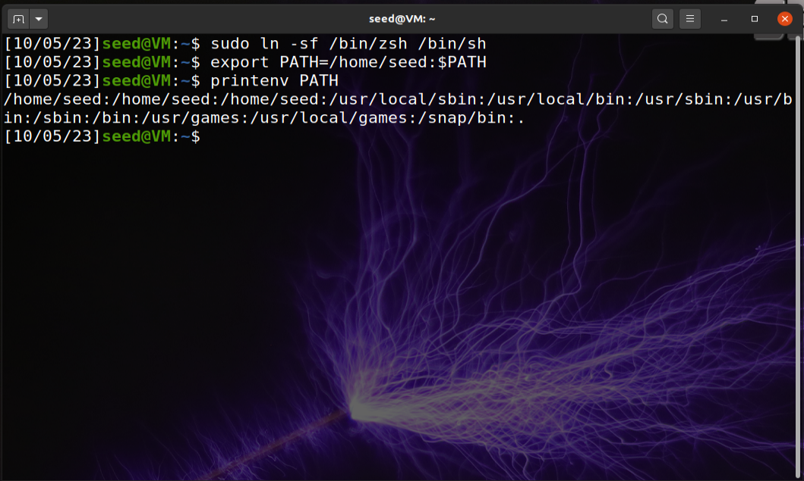

Disabling Set-UID protection and setting path.

---

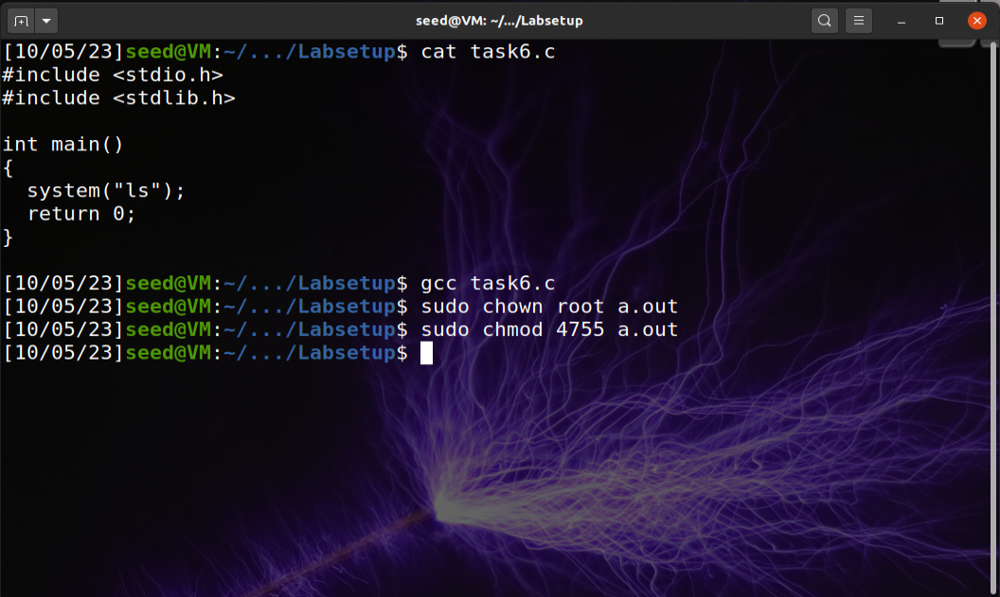

Compiling Set-UID program.

---

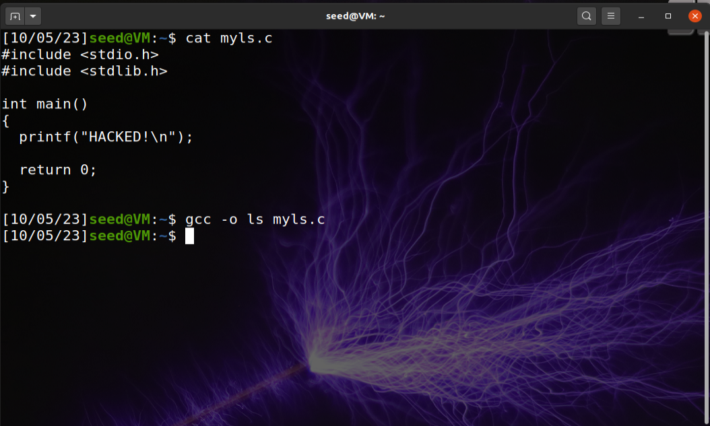

Compiling Malicious program.

---

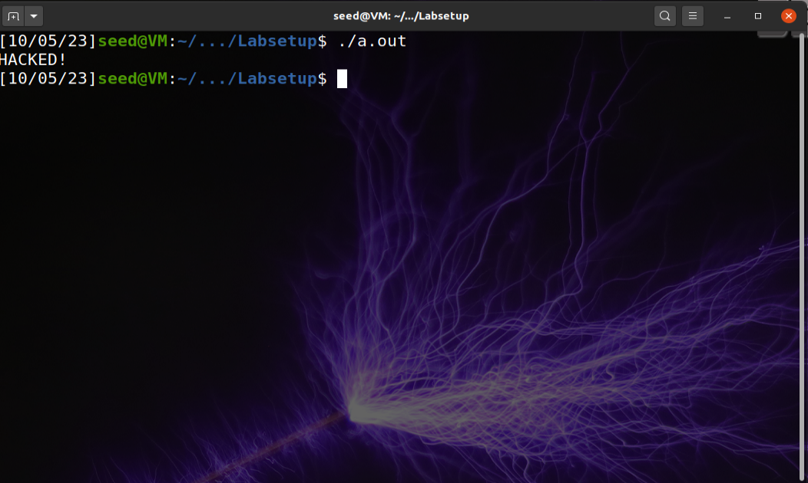

Running Set-UID program.

---

### Conclusion: 
Calling system in a Set-UID program enables users to control the program through environment variables. By setting "/home/seed" in PATH and by having "ls" program being called with relative path in system call, we can make the Set-UID program run our version of "ls" as long as our malicious code is located in the path we specified earlier. So when we ran the program, instead of a list of files in a directory, we saw the message "HACKED!" printed on the screen, meaning our version of "ls" was the one executed.
